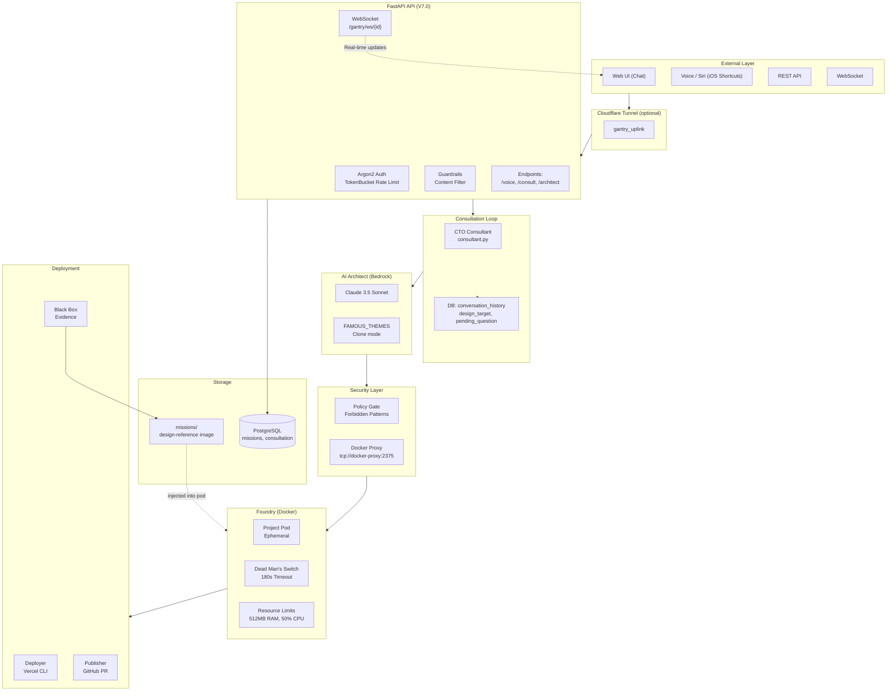
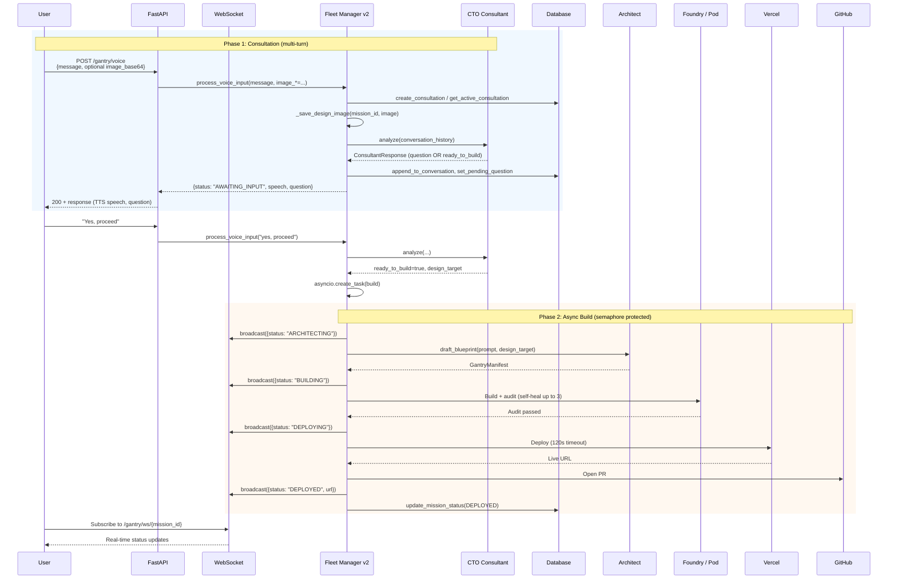
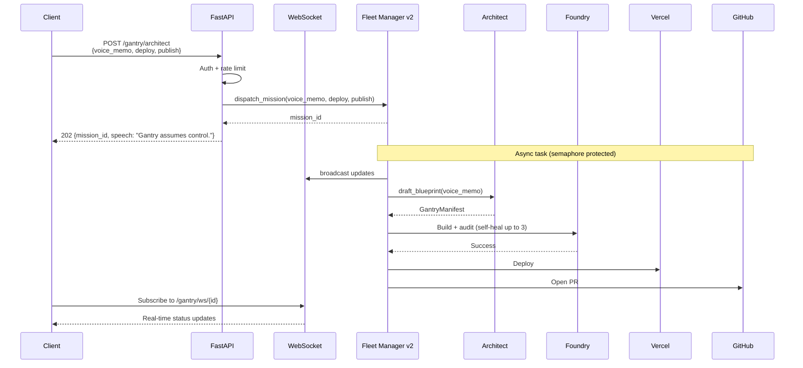
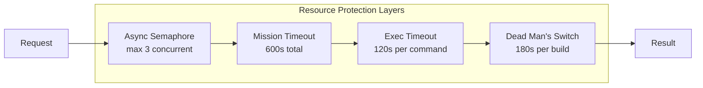
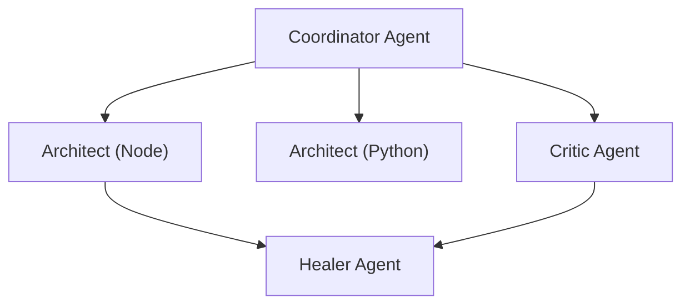

# GantryFleet Architecture

> Technical documentation for the GantryFleet Protocol (V7.0 - 2026 Architecture)

---

## Executive Summary

GantryFleet is a **production-grade AI software factory** that transforms natural language (and optional design images) into deployed applications. Unlike AI assistants that only generate code snippets, GantryFleet:

1. **Consults** via a CTO-style loop: propose plan → user feedback → confirm → build
2. **Builds** code in isolated Docker containers (Foundry)
3. **Tests** with self-healing (up to 3 retry attempts)
4. **Deploys** to Vercel with live URLs
5. **Publishes** via GitHub PR (never pushes to main) and **records** cryptographic audit evidence

---

## Architecture Overview (V7.0 - 2026)

| Aspect | V7.0 (Primary) | Description |
|--------|----------------|-------------|
| **API** | FastAPI (async) | Primary entry: `src/main_fastapi.py`. WebSocket + REST. |
| **Consultation** | CTO Consultant | `src/core/consultant.py`. Multi-turn: propose → question → confirm → build. |
| **Orchestration** | Fleet Manager v2 | `src/core/fleet_v2.py`. Async `process_voice_input()` with WebSocket broadcast. |
| **Auth** | Argon2 + TokenBucket | `src/core/auth_v2.py`. Modern password hashing + per-user rate limiting. |
| **Design Input** | Text + optional image | Image saved to `missions/{id}/design-reference.{ext}`, injected into pod by Foundry. |
| **Status** | WebSocket + REST | Real-time via `WS /gantry/ws/{id}`, polling via `GET /gantry/status/{id}`. |
| **Health** | Enhanced probes | `/health` (liveness), `/ready` (readiness) for Kubernetes/Docker. |
| **Legacy** | Flask (optional) | `src/main.py` + `src/core/fleet.py` for sync-only deployments. |

---

## High-Level Architecture



---

## Core Components

| Component | Role |
|-----------|------|
| **FastAPI** (`src/main_fastapi.py`) | Async API with WebSocket: `/gantry/voice`, `/gantry/consult`, `/gantry/ws/{id}`, `/gantry/themes`, `/gantry/architect`, `/gantry/status/{id}`, `/health`, `/ready`. |
| **CTO Consultant** (`src/core/consultant.py`) | Analyzes user message and conversation history; returns proposal, clarifying question, or `ready_to_build` with design_target. |
| **Fleet Manager v2** (`src/core/fleet_v2.py`) | Async `process_voice_input()`: consultation, image saving, build dispatch; WebSocket broadcast for real-time updates. |
| **Architect** (`src/core/architect.py`) | Drafts blueprint (GantryManifest); supports `design_target` (FAMOUS_THEMES) for clone mode. |
| **Foundry** (`src/core/foundry.py`) | Runs build in Docker; injects `missions/{id}/design-reference.*` into pod as `public/design-reference.*`. |
| **Policy** (`src/core/policy.py`) | Validates manifest (forbidden patterns, stack, limits). |
| **DB** (`src/core/db.py`) | Missions, conversation_history, design_target, pending_question, proposed_stack. |
| **Auth v2** (`src/core/auth_v2.py`) | Argon2 password hashing, TokenBucket rate limiting, session management. |

---

## API Endpoints (V7.0)

### Core Endpoints

| Method | Path | Description |
|--------|------|-------------|
| `GET` | `/` | Web UI |
| `GET` | `/health` | Enhanced health check (uptime, connections) |
| `GET` | `/ready` | Kubernetes/Docker readiness probe |
| `GET` | `/docs` | OpenAPI documentation |

### Authentication

| Method | Path | Description |
|--------|------|-------------|
| `POST` | `/gantry/auth` | Authenticate with password |
| `GET` | `/gantry/auth/status` | Check session validity |

### V6.5 Consultation Loop

| Method | Path | Description |
|--------|------|-------------|
| `POST` | `/gantry/voice` | Main entry: start/continue consultation |
| `POST` | `/gantry/consult` | Alias for /gantry/voice |
| `GET` | `/gantry/consultation/{id}` | Get consultation state |
| `GET` | `/gantry/themes` | List famous app themes |

### Build & Status

| Method | Path | Description |
|--------|------|-------------|
| `POST` | `/gantry/architect` | Direct build (bypasses consultation) |
| `POST` | `/gantry/chat` | Chat with Architect |
| `GET` | `/gantry/status/{id}` | Get mission status |
| `GET` | `/gantry/latest` | Get latest mission |
| `GET` | `/gantry/missions` | List all missions |

### Mission Management

| Method | Path | Description |
|--------|------|-------------|
| `POST` | `/gantry/missions/clear` | Clear all projects |
| `POST` | `/gantry/missions/{id}/retry` | Retry failed mission |
| `GET` | `/gantry/missions/{id}/failure` | Get failure details |
| `GET` | `/gantry/search` | Search missions |

### WebSocket

| Path | Description |
|------|-------------|
| `WS /gantry/ws/{id}` | Real-time mission updates |

---

## Interaction Flow Diagrams

### Consultation Flow (Primary: Voice / Chat)

This is the main V7.0 path: **Voice/Chat → CTO Proposal → User Feedback → "Proceed" → Build.**



### Direct Build (Legacy / Bypass Consultation)

Single-shot build without the consultation loop (e.g. automation or "build exactly this").



---

## Data Models

### Mission (DB)

Relevant fields for V7.0:

- `id`, `status`, `prompt`, `speech_output`
- `conversation_history` (JSONB): list of {role, content}
- `design_target` (e.g. "LINKEDIN", "TWITTER") for clone mode
- `pending_question`, `proposed_stack`
- Created via `create_consultation` / `create_mission`

### ConsultantResponse (Consultant)

- `response`: natural language reply
- `status`: `NEEDS_INPUT` | `NEEDS_CONFIRMATION` | `READY_TO_BUILD`
- `question`: optional clarifying question
- `design_target`, `proposed_stack`, `build_prompt`, `features`, `confidence`

### GantryManifest (Architect)

- `project_name`, `stack`, `files`, `audit_command`, `run_command`

---

## Security Architecture

- **Edge**: Cloudflare Tunnel (optional): DDoS, WAF.
- **API**: FastAPI + Argon2 auth, TokenBucket rate limiting, guardrails.
- **Policy Gate**: Forbidden patterns, stack whitelist, file limits (`policy.yaml`).
- **Docker**: No direct socket access; use Docker proxy (`tcp://docker-proxy:2375`).
- **Pod**: Ephemeral, 512MB limit, 50% CPU cap, 180s Dead Man's Switch.

---

## Robustness & Resource Protection

Gantry implements multiple layers of protection against timeouts and resource exhaustion:

### Container Execution Safety

| Protection | Value | Description |
|------------|-------|-------------|
| **Dead Man's Switch** | 180s | Build timeout (kills container) |
| **Exec Timeout** | 120s | Per-command timeout (`_exec_with_timeout`) |
| **Memory Limit** | 512MB | Container `mem_limit` |
| **CPU Limit** | 50% of 1 core | `cpu_period`, `cpu_quota` |
| **Dependency Install** | 90s | pip/npm install timeout |

### Fleet Manager Protection

| Protection | Value | Description |
|------------|-------|-------------|
| **Concurrent Missions** | 3 max | Async semaphore prevents server exhaustion |
| **Mission Timeout** | 600s (10 min) | Overall limit including all retries |
| **Self-Healing Retries** | 3 max | Before giving up |
| **Progress Tracking** | Async context manager | Prevents task leaks |

### Database Safety

| Protection | Value | Description |
|------------|-------|-------------|
| **Connection Timeout** | 10s | Prevents hanging connections |
| **Query Timeout** | 30s | PostgreSQL statement_timeout |
| **Pool Size** | 10 | Connection pool limit |

### Deployment Safety

| Protection | Value | Description |
|------------|-------|-------------|
| **Deploy Timeout** | 120s | Vercel CLI timeout |
| **Verification Retries** | 3 | Check URL accessibility |



---

## 2026 Architecture Enhancements

### Health & Readiness Probes

```python
# Liveness probe (is the service alive?)
GET /health → {"status": "healthy", "uptime_seconds": 3600, "websocket_connections": 5}

# Readiness probe (is the service ready to accept traffic?)
GET /ready → {"ready": true, "checks": {"database": true, "architect": true}}
```

### WebSocket Real-Time Updates

```javascript
// Client subscribes to mission updates
const ws = new WebSocket("wss://api.gantry.ai/gantry/ws/mission-id");
ws.onmessage = (event) => {
  const data = JSON.parse(event.data);
  // data: {type: "status", status: "BUILDING", message: "Building..."}
};
```

### Async Architecture Benefits

| Benefit | Description |
|---------|-------------|
| **Non-blocking** | Long builds don't block API responses |
| **Scalable** | Handle more concurrent requests |
| **Real-time** | WebSocket for instant updates |
| **Resource efficient** | Async semaphore instead of threads |

---

## Legacy: Flask Support

For deployments that require sync-only or cannot use WebSocket:

- **API**: `src/main.py` (Flask)
- **Fleet**: `src/core/fleet.py` (thread-based)
- **Auth**: `src/core/auth.py` (SHA256)

To use Flask instead of FastAPI, change `Dockerfile`:
```dockerfile
CMD ["python", "src/main.py"]
```

---

## Extension Points

- **New famous-app theme**: Add an entry to `FAMOUS_THEMES` in `src/core/architect.py` and expose via `GET /gantry/themes`.
- **Consultation behavior**: Adjust CTO system prompt and response parsing in `src/core/consultant.py`.
- **New stack or policy**: Update `policy.yaml`, `StackType`, and Foundry/Architect as needed.
- **New skill**: Add to `src/skills/` for pluggable capabilities.

---

## Future Roadmap: The Fractal Vision

The following features are planned for future iterations. **For early access or enterprise engagement, contact the author.**

### Multi-Agent Architecture (Research Phase)

The "Fractal Foundry" vision: GantryFleet will evolve from a single-agent factory to a **multi-agent swarm** where:

1. **Coordinator Agent**: Orchestrates the build pipeline
2. **Architect Agents**: Specialized for different tech stacks
3. **Critic Agent**: Independent code review before deployment
4. **Healer Agent**: Dedicated self-repair with learning from past failures



### Vector Memory (Planned)

Persistent embeddings for:
- Learning from successful builds
- Similarity search for code patterns
- User preference memory across sessions

**Target integrations:** Supabase Vector, Pinecone, pgvector

### Temporal Orchestration (Planned)

Workflow engine for:
- Long-running builds with checkpoints
- Rollback on failure
- Scheduled deployments
- Multi-stage pipelines

**Target:** Temporal.io or Inngest

### arc-core-sdk Injection (Research)

Generated applications include their own internal agents:
- In-app memory (vector DB)
- Self-monitoring and alerts
- Automated optimization

### Hybrid Cloud Architecture (Enterprise Subscription)

**This architecture is already implemented and available for enterprise subscribers.**

For high-scale production deployments, GantryFleet supports a 3-layer hybrid architecture:

```
┌─────────────────────────────────────────────────────────────┐
│                    LAYER 1: EDGE (Vercel)                   │
│  • Landing Page (marketing)                                 │
│  • Dashboard UI (Next.js)                                   │
│  • Auth (NextAuth.js)                                       │
│  • API Gateway (proxies to Fleet)                           │
└─────────────────────────────────────────────────────────────┘
                              │
                              ▼ API/WebSocket
┌─────────────────────────────────────────────────────────────┐
│                 LAYER 2: ORCHESTRATOR (Railway/Fly.io)      │
│  • FastAPI (main_fastapi.py)                               │
│  • PostgreSQL (Managed)                                     │
│  • Consultant Agent (stateless)                            │
│  • WebSocket Manager                                        │
└─────────────────────────────────────────────────────────────┘
                              │
                              ▼ Docker API (TLS)
┌─────────────────────────────────────────────────────────────┐
│                 LAYER 3: BUILD FARM (Cloud VPS)             │
│  • Docker Host (AWS/GCP/DigitalOcean/Hetzner)              │
│  • Foundry (spawns build containers)                        │
│  • Secure Docker Proxy                                      │
│  • Builder Image Cache                                      │
└─────────────────────────────────────────────────────────────┘
```

**Deployment Options:**

| Scale | Architecture | Estimated Cost |
|-------|--------------|----------------|
| **Startup** | Single Docker Compose | $0-6/mo |
| **Growth** | Vercel + Railway + VPS | $25-50/mo |
| **Enterprise** | Vercel + AWS/GCP + Kubernetes | $100-500/mo |

**Why This Architecture:**
- **Vercel** excels at frontend (CDN, edge functions, zero-config)
- **Railway/Fly.io** handles API and long-running processes
- **Dedicated Build Farm** required for Docker container spawning (neither Vercel nor Railway support Docker-in-Docker)

**Enterprise Benefits:**
- Global CDN for UI (Vercel Edge)
- Managed PostgreSQL with backups
- Auto-scaling build farm
- 99.9% SLA available
- Dedicated support

> **Note:** The hybrid architecture requires subscription. The default Docker Compose deployment is sufficient for most use cases and is completely free to self-host.

---

## Contact & Enterprise

**For advanced features, custom integrations, or enterprise deployment:**

📧 **Email:** [pramod.voola@gmail.com](mailto:pramod.voola@gmail.com)  
👤 **Author:** Pramod Kumar Voola

---

*Last updated: January 2026 (V7.0 - GantryFleet Production)*
