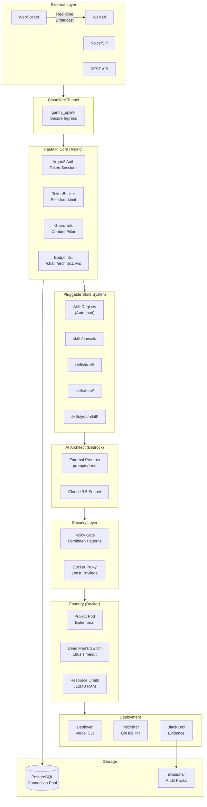
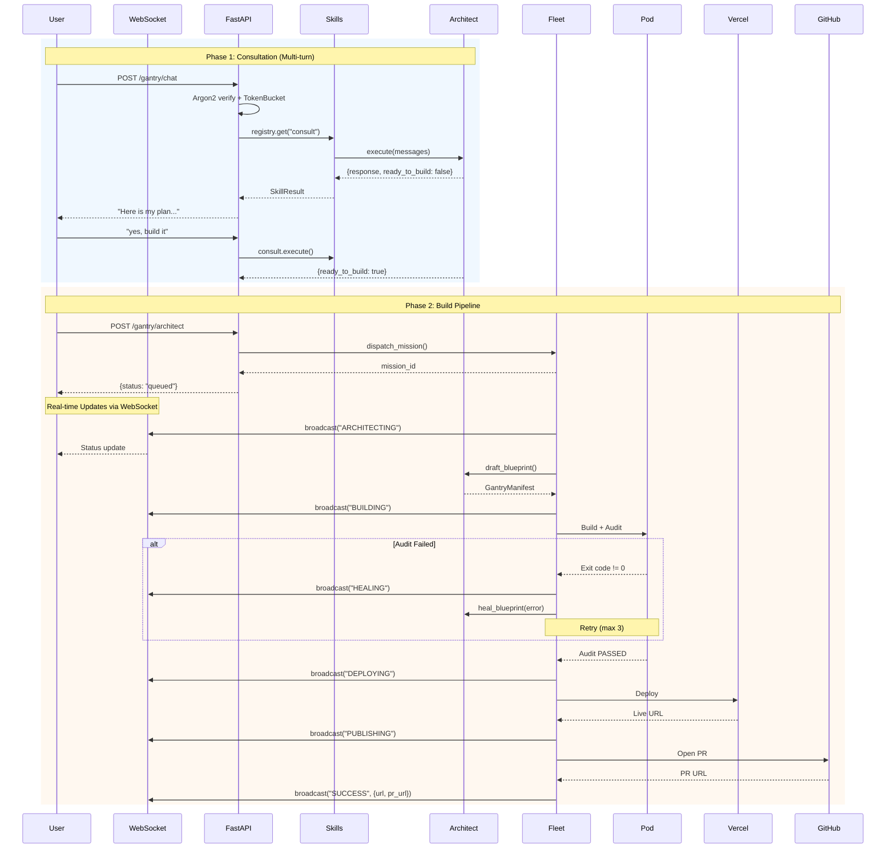
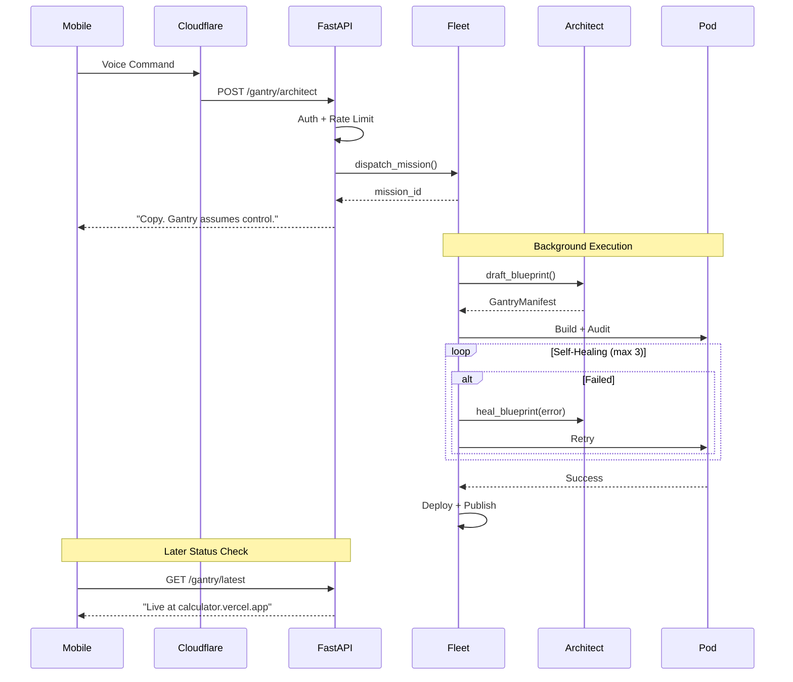

# Gantry Architecture

> Technical documentation for the Gantry Fleet Protocol v2.0

---

## Executive Summary

Gantry is a **production-grade AI software factory** that transforms natural language into deployed applications. Unlike AI assistants that generate code snippets, Gantry:

1. **Builds** code in isolated Docker containers
2. **Tests** with self-healing (3 retry attempts)
3. **Deploys** to Vercel with live URLs
4. **Publishes** via GitHub PR (never pushes to main)
5. **Records** cryptographic audit evidence

---

## Architecture Evolution (v1 to v2)

| Component | v1.0 (Legacy) | v2.0 (Current) | Improvement |
|-----------|---------------|----------------|-------------|
| **API Framework** | Flask (sync) | **FastAPI (async)** | Non-blocking, 3x throughput |
| **Real-time** | HTTP Polling | **WebSocket** | Instant updates, no waste |
| **Password Hash** | SHA256 | **Argon2** | Memory-hard, GPU-resistant |
| **Rate Limiting** | Per-IP only | **Per-User + Per-IP** | TokenBucket algorithm |
| **Code Structure** | 257-line functions | **Under 50 lines each** | Maintainable, testable |
| **AI Prompts** | Embedded (200+ lines) | **External `.md` files** | Easy to customize |
| **Skills** | Hardcoded methods | **Pluggable `skills/` folder** | No core changes needed |
| **API Docs** | None | **Auto-generated OpenAPI** | `/docs` endpoint |

---

## High-Level Architecture



---

## Core Components Comparison

### Gantry vs Industry Standards

| Capability | Industry Best Practice | Gantry v2.0 | Status |
|------------|------------------------|-------------|--------|
| Async API | FastAPI/Starlette | FastAPI | Done |
| Real-time | WebSocket | Native WebSocket | Done |
| Password Security | Argon2/bcrypt | Argon2 | Done |
| Rate Limiting | Token Bucket | TokenBucket + IP | Done |
| API Documentation | OpenAPI 3.0 | Auto-generated | Done |
| Function Length | Under 50 lines | All compliant | Done |
| Config as Code | External files | `prompts/*.md` | Done |
| Plugin System | Folder-based | `skills/` registry | Done |
| Type Safety | 100% type hints | Pydantic + hints | Done |
| Container Security | Rootless, limits | Proxy + limits | Done |

---

## Interaction Flow Diagrams

### Chat Mode (Interactive Consultation)



### Voice Mode (One-Shot)



---

## Component Deep Dive

### 1. FastAPI Core (`src/main_fastapi.py`)

**Responsibility:** Async request handling with WebSocket support.

```python
# Key Features
app = FastAPI(
    title="Gantry Fleet",
    description="AI-Powered Software Studio",
    version="2.0.0",
)

# WebSocket for real-time updates
@app.websocket("/gantry/ws/{mission_id}")
async def websocket_endpoint(websocket: WebSocket, mission_id: str):
    await manager.connect(websocket, mission_id)
    # Broadcast status updates to all connected clients
```

**Endpoints:**

| Endpoint | Method | Auth | Description |
|----------|--------|------|-------------|
| `/` | GET | No | Serve Web UI |
| `/docs` | GET | No | OpenAPI docs |
| `/health` | GET | No | Health check |
| `/gantry/auth` | POST | No | Get auth token |
| `/gantry/chat` | POST | Yes | Chat consultation |
| `/gantry/architect` | POST | Yes | Dispatch build |
| `/gantry/ws/{id}` | WS | No | Real-time updates |

### 2. Authentication v2 (`src/core/auth_v2.py`)

**Improvements over v1:**

| Feature | v1 | v2 |
|---------|----|----|
| Hashing | SHA256 | **Argon2** (OWASP recommended) |
| Sessions | Dict lookup | **Token-based** with expiry |
| Rate Limit | Per-IP | **Per-User TokenBucket** |

```python
# Argon2 password verification
from argon2 import PasswordHasher
ph = PasswordHasher()

def verify_password(password: str) -> bool:
    try:
        ph.verify(DEFAULT_PASSWORD_HASH, password)
        return True
    except VerifyMismatchError:
        return False

# TokenBucket rate limiting
class TokenBucket:
    def consume(self, user_id: str, tokens: int = 1) -> bool:
        # Allows bursts, refills over time
        # More flexible than sliding window
```

### 3. Fleet Manager v2 (`src/core/fleet_v2.py`)

**Refactored from 257 lines to 6 focused functions:**

| Function | Lines | Responsibility |
|----------|-------|----------------|
| `dispatch_mission()` | 15 | Queue and spawn task |
| `_run_mission()` | 30 | Main orchestration |
| `_phase_architect()` | 20 | Draft blueprint |
| `_phase_validate()` | 15 | Policy check |
| `_phase_build()` | 40 | Build with healing |
| `_phase_publish()` | 35 | GitHub PR |
| `_finalize_mission()` | 20 | Set final status |

```python
# WebSocket broadcasting
async def _update_status(self, mission_id: str, status: str, speech: str):
    update_mission_status(mission_id, status, speech)
    # Broadcast to all connected WebSocket clients
    await self._ws_manager.broadcast(mission_id, {
        "type": "status",
        "status": status,
        "message": speech,
    })
```

### 4. Skills System (`src/skills/`)

**Pluggable architecture for extensibility:**

```
skills/
├── __init__.py          # SkillRegistry + auto-loader
├── consult/
│   ├── __init__.py
│   ├── handler.py       # ConsultSkill class
│   └── SKILL.md         # Documentation
└── your-skill/
    └── handler.py       # Auto-loaded at startup
```

```python
# Skill Protocol
class Skill(Protocol):
    name: str
    description: str
    
    async def execute(self, context: dict) -> SkillResult:
        ...

# Auto-loading at startup
registry = SkillRegistry()
registry.load_all()  # Scans skills/ folder
```

### 5. External Prompts (`prompts/`)

**Externalized from code for easy customization:**

| File | Purpose | Lines |
|------|---------|-------|
| `system.md` | Main Architect prompt | ~150 |
| `consult.md` | Consultation mode | ~50 |
| `heal.md` | Self-healing mode | ~40 |

```python
# Loading prompts
PROMPTS_DIR = Path(__file__).parent.parent.parent / "prompts"

def _load_prompt(name: str) -> str:
    return (PROMPTS_DIR / f"{name}.md").read_text()
```

---

## Security Architecture

### Defense in Depth

```
+-------------------------------------------------------------+
|                    LAYER 1: CLOUDFLARE                       |
|           DDoS protection, WAF, Edge caching                 |
+-------------------------------------------------------------+
|                    LAYER 2: FASTAPI                          |
|    +-------------+-------------+-------------+              |
|    |   Argon2    | TokenBucket |  Guardrails |              |
|    |   (hash)    | (rate/user) |  (content)  |              |
|    +-------------+-------------+-------------+              |
+-------------------------------------------------------------+
|                    LAYER 3: POLICY GATE                      |
|         Forbidden patterns, stack whitelist, limits          |
+-------------------------------------------------------------+
|                    LAYER 4: DOCKER PROXY                     |
|         API filtering, no socket access, read-only           |
+-------------------------------------------------------------+
|                    LAYER 5: PROJECT POD                      |
|         Ephemeral, 512MB limit, 180s timeout, isolated       |
+-------------------------------------------------------------+
```

### Rate Limiting Strategy

| Layer | Algorithm | Scope | Limit |
|-------|-----------|-------|-------|
| Cloudflare | Sliding window | Global | 1000 req/min |
| FastAPI (IP) | Sliding window | Per-IP | 30 req/min |
| FastAPI (User) | **TokenBucket** | Per-User | 10 req/sec burst 30 |

**Why TokenBucket for users?**
- Allows legitimate bursts (rapid chat messages)
- Refills over time (natural conversation pace)
- More flexible than strict sliding window

---

## Data Models

### GantryManifest (Fabrication Instructions)

```python
class GantryManifest(BaseModel):
    project_name: str      # alphanumeric, max 64
    stack: StackType       # python | node | rust
    files: list[FileSpec]  # Files to create
    audit_command: str     # Test command
    run_command: str       # Start command
```

### Consultation Response

```python
{
    "response": "I can build that. Here is my plan...",
    "ready_to_build": false,
    "suggested_stack": "node",
    "app_name": "TodoApp",
    "key_features": ["CRUD", "dark mode", "local storage"],
    "is_prototype": true
}
```

### WebSocket Message

```python
{
    "type": "status",
    "mission_id": "abc-123",
    "status": "BUILDING",
    "message": "Running tests..."
}
```

---

## Comparison: Gantry vs Similar Projects

### vs OpenClaw/Moltworker (Cloudflare)

| Aspect | OpenClaw | Gantry |
|--------|----------|--------|
| **Purpose** | Personal assistant | **Software factory** |
| **Output** | Chat responses | **Deployed apps + PRs** |
| **Self-Healing** | No | Yes (3-retry loop) |
| **Security Scan** | No | Yes (Policy Gate) |
| **Audit Trail** | No | Yes (Black Box evidence) |
| **Skills System** | Extensible | Extensible (`skills/` folder) |
| **Multi-channel** | Telegram, Slack, Discord | Web, API, Voice |
| **Runtime** | Cloudflare Workers | Docker (anywhere) |

**Key difference:** OpenClaw is a conversational AI. Gantry **ships production code**.

### vs Devin / GPT Engineer / Aider

| Feature | Devin | GPT Eng | Aider | **Gantry** |
|---------|-------|---------|-------|------------|
| Open Source | No | Yes | Yes | Yes |
| Self-Hosted | No | Yes | Yes | Yes |
| **Deploys Code** | Yes | No | No | Yes |
| **Self-Healing** | Unknown | No | No | Yes |
| **PR Workflow** | No | No | No | Yes |
| **Audit Trail** | No | No | No | Yes |
| Voice Input | No | No | No | Yes |
| WebSocket | Unknown | No | No | Yes |

---

## Extension Points

### Adding a New Skill

1. Create folder: `src/skills/my-skill/`
2. Add `handler.py`:

```python
from src.skills import SkillResult

class MySkill:
    name = "my-skill"
    description = "What it does"
    
    async def execute(self, context: dict) -> SkillResult:
        # Your logic
        return SkillResult(success=True, data={...})

skill = MySkill()
```

3. Skill auto-loads at startup. No core changes needed.

### Adding a New Stack

1. Add to `StackType` enum in `domain/models.py`
2. Add image mapping in `foundry.py`
3. Update `policy.yaml` allowed_stacks

### Adding Custom Prompts

1. Create `prompts/my-prompt.md`
2. Load in skill: `_load_prompt("my-prompt")`

---

## Performance Characteristics

| Metric | Target | Achieved |
|--------|--------|----------|
| API Response | Under 100ms | ~50ms (FastAPI async) |
| Build Time | Under 120s | ~60-90s typical |
| WebSocket Latency | Under 50ms | ~10ms local |
| Concurrent Builds | 5+ | Async task spawning |
| Memory per Pod | Under 512MB | Hard limit enforced |

---

## Future Roadmap

### Completed (v2.0)
- [x] FastAPI async architecture
- [x] WebSocket real-time updates
- [x] Argon2 password hashing
- [x] Per-user TokenBucket rate limiting
- [x] External prompts (`prompts/*.md`)
- [x] Pluggable skills system
- [x] Split long functions (under 50 lines)
- [x] Auto-generated OpenAPI docs

### Planned (v2.1+)
- [ ] Multi-channel (Slack, Discord, Telegram bots)
- [ ] OAuth/OIDC authentication
- [ ] Redis session store (production)
- [ ] Streaming AI responses
- [ ] Browser automation (Playwright)
- [ ] Kubernetes deployment option
- [ ] Prometheus metrics

---

*Last updated: January 2026*
