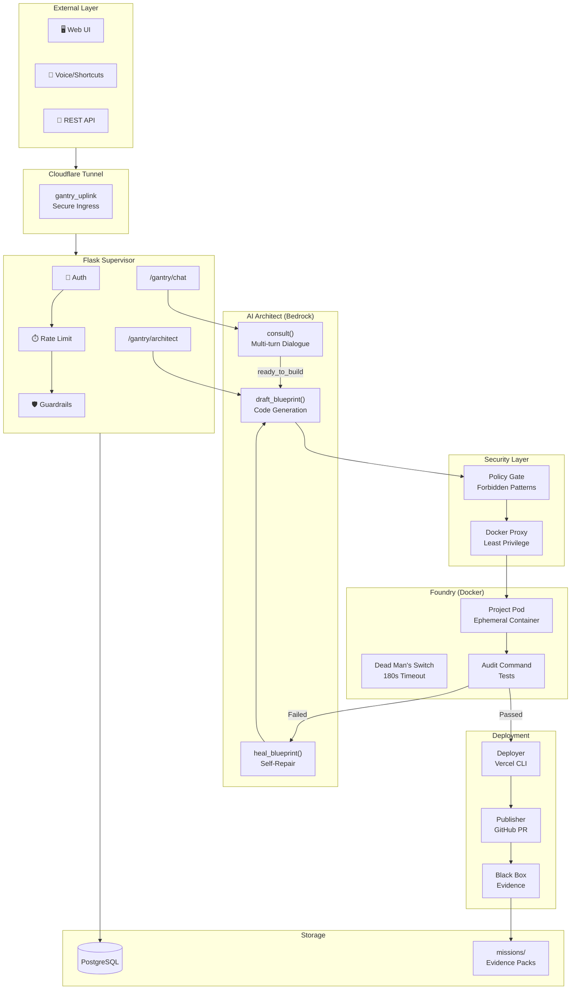
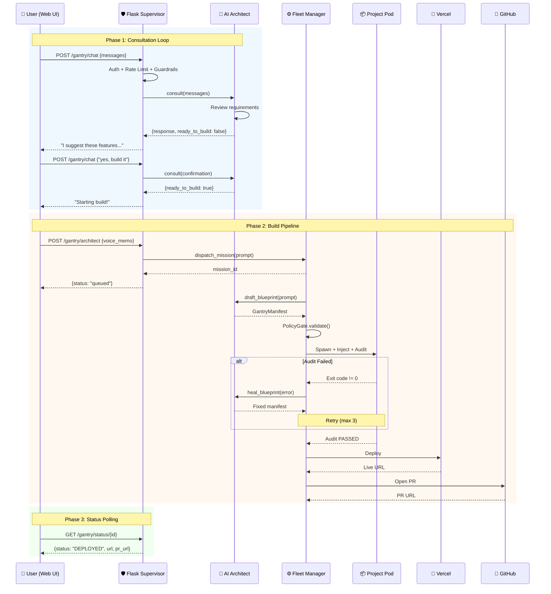
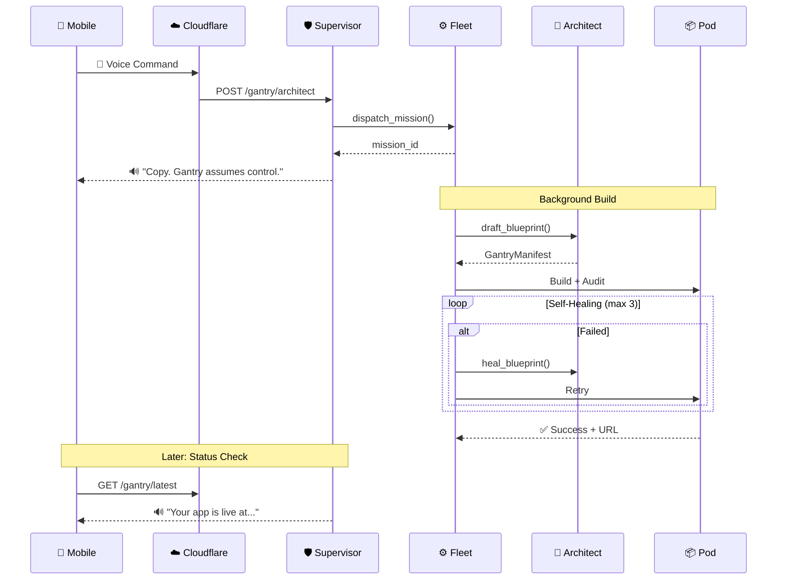

# Gantry Architecture

> Technical documentation for the Gantry Fleet Protocol

## Overview

Gantry implements a **Supervisor-Worker** pattern where a persistent supervisor (Fleet Manager) orchestrates ephemeral workers (Project Pods) to execute build missions.

The system supports **two interaction modes**:
1. **Chat Mode** - Bidirectional conversation with the Architect before building
2. **Voice Mode** - One-shot command dispatch for quick builds

---

## High-Level Architecture



---

## Interaction Flow Diagrams

### Chat Mode (Interactive Consultation)

This is the primary interaction pattern via the Web UI:



### Voice Mode (One-Shot Command)

For quick builds via iOS Shortcuts or API:



---

## System Architecture

```
┌─────────────────────────────────────────────────────────────────────────────┐
│                           EXTERNAL LAYER                                     │
│  ┌──────────────┐   ┌──────────────┐   ┌──────────────┐                     │
│  │   WEB UI     │   │  iOS/Voice   │   │  REST API    │                     │
│  │ (index.html) │   │  (Shortcut)  │   │   (curl)     │                     │
│  └──────────────┘   └──────────────┘   └──────────────┘                     │
│         │                  │                  │                              │
│         └──────────────────┼──────────────────┘                              │
│                            │                                                 │
│                            ▼                                                 │
│  ┌─────────────────────────────────────────────────────────────────────┐    │
│  │                    CLOUDFLARE TUNNEL (gantry_uplink)                 │    │
│  │                    Secure ingress, DDoS protection                   │    │
│  └─────────────────────────────────────────────────────────────────────┘    │
├─────────────────────────────────────────────────────────────────────────────┤
│                           API LAYER (main.py)                                │
│  ┌─────────────────────────────────────────────────────────────────────┐    │
│  │                       FLASK SUPERVISOR                               │    │
│  │  ┌────────────┐  ┌────────────┐  ┌────────────┐  ┌────────────┐     │    │
│  │  │ Rate Limit │  │    Auth    │  │ Guardrails │  │  Sessions  │     │    │
│  │  └────────────┘  └────────────┘  └────────────┘  └────────────┘     │    │
│  │                                                                      │    │
│  │  Endpoints:                                                          │    │
│  │  • GET  /              → Serve Web UI                                │    │
│  │  • POST /gantry/auth   → Authenticate session                        │    │
│  │  • POST /gantry/chat   → Consultation (multi-turn)                   │    │
│  │  • POST /gantry/architect → Build dispatch (one-shot)                │    │
│  │  • GET  /gantry/status → Mission status                              │    │
│  └─────────────────────────────────────────────────────────────────────┘    │
├─────────────────────────────────────────────────────────────────────────────┤
│                           CORE LAYER                                         │
│                                                                              │
│  ┌────────────────────────────────────────────────────────────────────┐     │
│  │                      AI ARCHITECT (architect.py)                    │     │
│  │                                                                     │     │
│  │  Skills:                                                            │     │
│  │  • consult()       → Multi-turn conversation, suggests features     │     │
│  │  • draft_blueprint → Generate GantryManifest from prompt            │     │
│  │  • heal_blueprint  → Fix failing builds by analyzing errors         │     │
│  │                                                                     │     │
│  │  Backend: AWS Bedrock (Claude 3.5 Sonnet)                           │     │
│  └────────────────────────────────────────────────────────────────────┘     │
│                            │                                                 │
│          ┌─────────────────┼─────────────────┐                              │
│          ▼                 ▼                 ▼                              │
│  ┌──────────────┐  ┌──────────────┐  ┌──────────────┐                       │
│  │ POLICY GATE  │  │    FLEET     │  │   DATABASE   │                       │
│  │ (policy.py)  │  │  (fleet.py)  │  │   (db.py)    │                       │
│  │              │  │              │  │              │                       │
│  │ • Validates  │  │ • Orchestrat │  │ • Missions   │                       │
│  │   manifests  │  │   pipeline   │  │ • Status     │                       │
│  │ • Blocks     │  │ • Self-heal  │  │ • Speech     │                       │
│  │   patterns   │  │   loop       │  │              │                       │
│  └──────────────┘  └──────────────┘  └──────────────┘                       │
│                            │                                                 │
│                            ▼                                                 │
│  ┌─────────────────────────────────────────────────────────────────────┐    │
│  │                        FOUNDRY (foundry.py)                          │    │
│  │                                                                      │    │
│  │  • Spawns Project Pods (Docker containers)                           │    │
│  │  • Injects files via tar                                             │    │
│  │  • Runs audit_command (tests)                                        │    │
│  │  • Enforces Dead Man's Switch (180s timeout)                         │    │
│  │  • Creates Black Box evidence                                        │    │
│  └─────────────────────────────────────────────────────────────────────┘    │
│                            │                                                 │
│          ┌─────────────────┼─────────────────┐                              │
│          ▼                 ▼                 ▼                              │
│  ┌──────────────┐  ┌──────────────┐  ┌──────────────┐                       │
│  │   DEPLOYER   │  │  PUBLISHER   │  │  BLACK BOX   │                       │
│  │ (deployer.py)│  │(publisher.py)│  │  (foundry)   │                       │
│  │              │  │              │  │              │                       │
│  │ • Vercel CLI │  │ • GitHub API │  │ • manifest   │                       │
│  │ • Parse URL  │  │ • Feature BR │  │ • audit logs │                       │
│  │ • Verify     │  │ • Open PR    │  │ • evidence   │                       │
│  └──────────────┘  └──────────────┘  └──────────────┘                       │
├─────────────────────────────────────────────────────────────────────────────┤
│                         INFRASTRUCTURE LAYER                                 │
│  ┌──────────────┐  ┌──────────────┐  ┌──────────────┐                       │
│  │ DOCKER PROXY │  │  POSTGRESQL  │  │  PROJECT POD │                       │
│  │  (tecnativa) │  │   (gantry_db)│  │ (gantry/     │                       │
│  │              │  │              │  │   builder)   │                       │
│  │ Least-privil │  │ Conn pooling │  │ Ephemeral    │                       │
│  └──────────────┘  └──────────────┘  └──────────────┘                       │
└─────────────────────────────────────────────────────────────────────────────┘
```

---

## Layer Responsibilities

### 1. Web UI (`src/static/index.html`)

**Responsibility:** Chat interface and projects dashboard.

Features:
- **Chat Panel** - Multi-turn conversation with Architect
- **Projects Panel** - Real-time mission status with pagination
- **Authentication** - Password login with session management
- **Status Polling** - Auto-refresh every 10 seconds
- **Responsive** - Works on mobile and desktop

Key JavaScript functions:
- `handleSend()` - Sends messages to `/gantry/chat`
- `pollMission()` - Tracks build progress
- `loadProjects()` - Fetches mission list

### 2. Flask Supervisor (`src/main.py`)

**Responsibility:** Request handling, authentication, and routing.

Key endpoints:
- `POST /gantry/chat` - Multi-turn consultation with conversation history
- `POST /gantry/architect` - One-shot build dispatch
- `GET /gantry/status/<id>` - Mission status for polling

Decorators:
- `@require_rate_limit` - Sliding window per-IP limiting
- `@require_auth` - Session-based password authentication
- `@require_guardrails` - Content filtering for junk requests

### 3. AI Architect (`src/core/architect.py`)

**Responsibility:** AI-powered code generation and consultation.

**Skills:**

| Skill | Purpose | Input | Output |
|-------|---------|-------|--------|
| `consult()` | Multi-turn dialogue | Message history | `{response, ready_to_build, suggested_stack, ...}` |
| `draft_blueprint()` | Generate code | Build prompt | `GantryManifest` |
| `heal_blueprint()` | Fix failures | Manifest + error log | Fixed `GantryManifest` |

**Consultation Flow:**

```python
# User starts with vague idea
messages = [{"role": "user", "content": "build a todo app"}]
result = architect.consult(messages)
# result.ready_to_build = False
# result.response = "I can build that! Here's what I suggest..."

# User confirms
messages.append({"role": "assistant", "content": result.response})
messages.append({"role": "user", "content": "yes, build it"})
result = architect.consult(messages)
# result.ready_to_build = True
# -> Now dispatch the actual build
```

### 4. Policy Gate (`src/core/policy.py`)

**Responsibility:** Zero-trust validation of all manifests.

Enforces:
- **Allowed Stacks** - python, node, rust only
- **Forbidden Patterns** - rm -rf, eval, shell injection
- **File Count Limits** - Max 10 files per manifest

### 5. Fleet Manager (`src/core/fleet.py`)

**Responsibility:** Mission orchestration with self-healing.

Pipeline phases:
1. **ARCHITECTING** - Generate GantryManifest
2. **VALIDATING** - Policy check
3. **BUILDING** - Docker build + audit
4. **HEALING** - Fix failures (up to 3 retries)
5. **DEPLOYING** - Vercel deployment
6. **PUBLISHING** - GitHub PR

### 6. Foundry (`src/core/foundry.py`)

**Responsibility:** Docker container management.

Features:
- **Dead Man's Switch** - 180s hard timeout
- **Resource Limits** - 512MB memory cap
- **Black Box** - Evidence folder for every mission
- **Structure Check** - Validates Vercel serverless format

### 7. Deployer (`src/core/deployer.py`)

**Responsibility:** Vercel deployment.

Flow:
1. Run `vercel deploy --prod` inside container
2. Parse production URL from output
3. Verify deployment is accessible

### 8. Publisher (`src/core/publisher.py`)

**Responsibility:** GitHub PR workflow.

Enforces:
- **Green-Only Rule** - Only passing audits can publish
- **Junior Dev Model** - Never push to main, always PR
- **Evidence Linking** - PR body includes audit evidence path

---

## Data Models

### GantryManifest (Fabrication Instructions)

```python
class GantryManifest(BaseModel):
    project_name: str      # Identifier for logging/containers
    stack: StackType       # python | node | rust
    files: list[FileSpec]  # Files to inject into Pod
    audit_command: str     # Critic's test command
    run_command: str       # How to start the app
```

### Consultation Response

```python
{
    "response": "Plain text response to user",
    "ready_to_build": false,
    "suggested_stack": "node",
    "app_name": "TodoApp",
    "app_type": "Web App",
    "key_features": ["feature1", "feature2"],
    "is_prototype": true,
    "continue_from": null
}
```

### Mission Lifecycle

```
PENDING → ARCHITECTING → VALIDATING → BUILDING → [HEALING] → DEPLOYING → PUBLISHING → SUCCESS
                                          ↑          │
                                          └──────────┘
                                         (Self-repair loop)
```

---

## Security Architecture

### Defense in Depth

```
┌───────────────────────────────────────────────────────────────┐
│                     CLOUDFLARE EDGE                            │
│                  (DDoS, WAF, Rate Limit)                       │
├───────────────────────────────────────────────────────────────┤
│                   GANTRY_UPLINK (Tunnel)                       │
│              (Encrypted tunnel to local network)               │
├───────────────────────────────────────────────────────────────┤
│                    FLASK SUPERVISOR                            │
│         (Auth, Rate Limit, Guardrails, Sessions)               │
├───────────────────────────────────────────────────────────────┤
│                     POLICY GATE                                │
│          (Forbidden patterns, stack whitelist)                 │
├───────────────────────────────────────────────────────────────┤
│                   DOCKER SOCKET PROXY                          │
│        (Least-privilege API, no dangerous ops)                 │
├───────────────────────────────────────────────────────────────┤
│                    PROJECT POD                                 │
│         (Isolated container, resource limits)                  │
└───────────────────────────────────────────────────────────────┘
```

### Rate Limiting

- **Window:** 60 seconds
- **Max Requests:** 30 per IP per window
- **Blocking:** IP blocked for window duration after limit exceeded

### Content Guardrails

Blocks requests that are:
- Too short (< 10 characters)
- Missing intent keywords (build, create, make, app, etc.)
- Contain profanity or keyboard mashing
- Just greetings without build intent

---

## Evidence Pack Structure

Every mission creates a dedicated folder:

```
missions/
└── {mission_id}/
    ├── manifest.json        # The fabrication instructions
    ├── audit_pass.json      # OR audit_fail.json
    ├── flight_recorder.json # Complete event log
    └── publish/             # Source files for GitHub
        ├── public/
        │   └── index.html
        ├── api/
        │   └── index.js
        ├── package.json
        └── vercel.json
```

---

## Configuration

### Environment Variables

| Variable | Required | Description |
|----------|----------|-------------|
| `BEDROCK_API_KEY` | Yes | AWS Bedrock API key |
| `GANTRY_PASSWORD` | Yes | API password (auto-hashed) |
| `VERCEL_TOKEN` | No | Vercel deployment token |
| `GITHUB_TOKEN` | No | GitHub PAT with `repo` scope |
| `GITHUB_USERNAME` | No | GitHub username |
| `DB_HOST` | Yes | PostgreSQL host |
| `DB_PASSWORD` | Yes | PostgreSQL password |
| `CLOUDFLARE_TUNNEL_TOKEN` | No | For persistent domain |

---

## Extension Points

### Adding a New Skill

1. Add method to `Architect` class
2. Create system prompt for the skill
3. Add endpoint in `main.py`
4. Update Web UI if needed
5. Write tests

### Adding a New Stack

1. Add to `StackType` enum in `domain/models.py`
2. Add image mapping in `foundry.py` `STACK_IMAGES`
3. Update `policy.yaml` allowed_stacks
4. Add structure verification if needed

---

## Comparison with Similar Projects

### Gantry vs OpenClaw/Moltworker

[OpenClaw](https://github.com/cloudflare/moltworker) is Cloudflare's personal AI assistant that runs in Cloudflare Sandbox. While both are AI agent architectures, they solve different problems:

| Aspect | Gantry | OpenClaw/Moltworker |
|--------|--------|---------------------|
| **Purpose** | Software Factory - *builds and deploys apps* | Personal Assistant - *chats and responds* |
| **Output** | Live websites, GitHub PRs, deployed code | Conversational responses |
| **Runtime** | Docker containers (local/server) | Cloudflare Sandbox (edge) |
| **Channels** | Web UI, Voice API | Telegram, Discord, Slack, Web |
| **Auth** | Password + session | Device pairing + Cloudflare Access |
| **Persistence** | PostgreSQL | R2 Storage |
| **Self-Healing** | Yes (3 retry attempts) | No |
| **Browser Automation** | No | Yes (CDP) |
| **Skills System** | Architect methods | Extensible skills folder |

**Key Insight:** Gantry is to *software development* what OpenClaw is to *conversation*. 

- **OpenClaw** = "Talk to your AI assistant"
- **Gantry** = "Tell your AI to build something, and it deploys it"

### What Gantry Could Learn from OpenClaw

1. **Multi-channel support** - Add Telegram/Discord/Slack bots
2. **Device pairing** - More secure than password auth
3. **Skills folder** - External, pluggable skills vs hardcoded methods
4. **Cloudflare Sandbox** - Edge deployment option

### What Makes Gantry Unique

1. **Code Generation + Deployment** - Not just chat, but actual production output
2. **Self-Healing CI/CD** - Analyzes errors and fixes them automatically
3. **Junior Dev Model** - Never pushes to main, always opens PRs
4. **Black Box Evidence** - Cryptographic audit trail for every build
5. **Policy Gate** - Security scanning before any code runs

---

## Future Roadmap Ideas

Based on similar projects and community feedback:

- [ ] Multi-channel input (Telegram, Discord, Slack bots)
- [ ] Device pairing authentication
- [ ] Browser automation for testing (Playwright/CDP)
- [ ] Cloudflare Workers deployment option
- [ ] External skills folder (pluggable capabilities)
- [ ] Image-based architecture diagrams in `assets/`

---

*Last updated: 2026*
