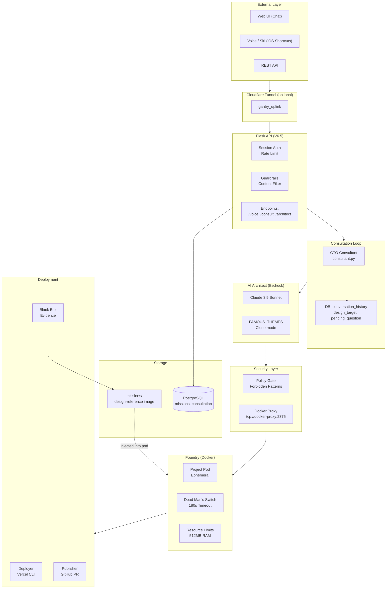
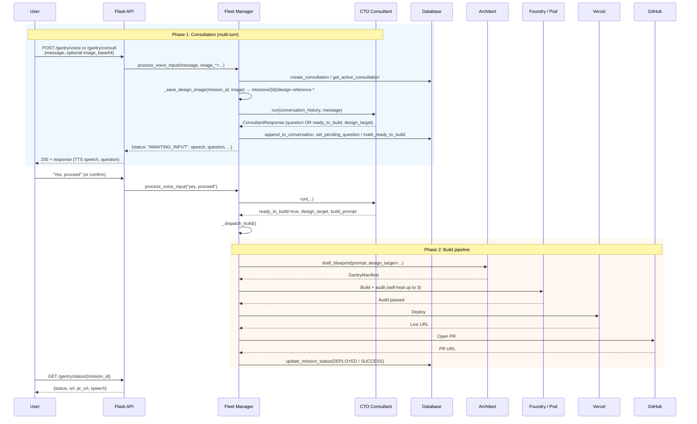
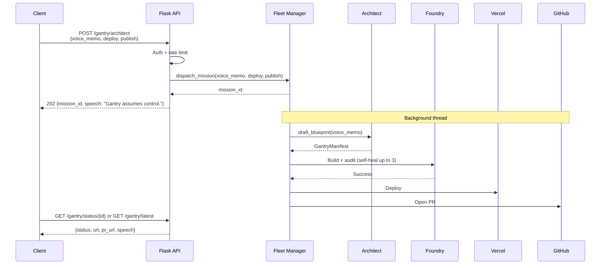
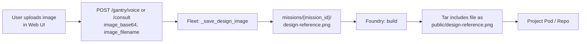

# Gantry Architecture

> Technical documentation for the Gantry Fleet Protocol (V6.5 Consultation Loop)

---

## Executive Summary

Gantry is a **production-grade AI software factory** that transforms natural language (and optional design images) into deployed applications. Unlike AI assistants that only generate code snippets, Gantry:

1. **Consults** via a CTO-style loop: propose plan → user feedback → confirm → build
2. **Builds** code in isolated Docker containers (Foundry)
3. **Tests** with self-healing (up to 3 retry attempts)
4. **Deploys** to Vercel with live URLs
5. **Publishes** via GitHub PR (never pushes to main) and **records** cryptographic audit evidence

---

## Architecture Overview (V6.5)

| Aspect | Current (V6.5) | Description |
|--------|----------------|-------------|
| **API** | Flask (sync) | Primary entry: `src/main.py`. REST only; status via polling. |
| **Consultation** | CTO Consultant | `src/core/consultant.py`. Multi-turn: propose → question → confirm → build. |
| **Orchestration** | Fleet Manager | `src/core/fleet.py`. `process_voice_input()` drives consultation then build. |
| **Auth** | Session + rate limit | `src/core/auth.py`. Password (SHA256) + per-IP rate limiting. |
| **Design Input** | Text + optional image | Image saved to `missions/{id}/design-reference.{ext}`, injected into pod by Foundry. |
| **Status** | Polling | `GET /gantry/status/<id>` and `GET /gantry/consultation/<id>`. |
| **Optional** | FastAPI + WebSocket | `src/main_fastapi.py` + `fleet_v2` for async/real-time; skills in `src/skills/`. |

---

## High-Level Architecture

---

## Core Components

| Component | Role |
|-----------|------|
| **Flask API** (`src/main.py`) | Serves Web UI, `/gantry/auth`, `/gantry/voice`, `/gantry/consult`, `/gantry/consultation/<id>`, `/gantry/themes`, `/gantry/architect`, `/gantry/status/<id>`, etc. |
| **CTO Consultant** (`src/core/consultant.py`) | Analyzes user message and conversation history; returns proposal, clarifying question, or `ready_to_build` with design_target. |
| **Fleet Manager** (`src/core/fleet.py`) | `process_voice_input()`: start/continue consultation, save design image, call Consultant; on confirm, `_dispatch_build()` → Architect → Policy → Foundry → Deploy → Publish. |
| **Architect** (`src/core/architect.py`) | Drafts blueprint (GantryManifest); supports `design_target` (FAMOUS_THEMES) for clone mode. |
| **Foundry** (`src/core/foundry.py`) | Runs build in Docker; injects `missions/{id}/design-reference.*` into pod as `public/design-reference.*`. |
| **Policy** (`src/core/policy.py`) | Validates manifest (forbidden patterns, stack, limits). |
| **DB** (`src/core/db.py`) | Missions, conversation_history, design_target, pending_question, proposed_stack. |

---

## Interaction Flow Diagrams

### Consultation Flow (Primary: Voice / Chat)

This is the main V6.5 path: **Voice/Chat → CTO Proposal → User Feedback → “Proceed” → Build.**

### Direct Build (Legacy / Bypass Consultation)

Single-shot build without the consultation loop (e.g. automation or “build exactly this”).

### Design Image Flow

Optional image attached to a consultation is stored and then included in the built repo.

---

## Data Models

### Mission (DB)

Relevant fields for V6.5:

- `id`, `status`, `prompt`, `speech_output`
- `conversation_history` (JSONB): list of {role, content}
- `design_target` (e.g. "LINKEDIN", "TWITTER") for clone mode
- `pending_question`, `proposed_stack`
- Created via `create_consultation` / `create_mission`; updated by `append_to_conversation`, `set_design_target`, `mark_ready_to_build`, etc.

### ConsultantResponse (Consultant)

- `response`: natural language reply
- `status`: `NEEDS_INPUT` | `NEEDS_CONFIRMATION` | `READY_TO_BUILD`
- `question`: optional clarifying question
- `design_target`, `proposed_stack`, `build_prompt`, `features`, `confidence`

### GantryManifest (Architect)

- `project_name`, `stack`, `files`, `audit_command`, `run_command`

---

## Security Architecture

- **Edge**: Cloudflare Tunnel (optional): DDoS, WAF.
- **API**: Flask + session auth (password, SHA256 or env hash), rate limiting, guardrails.
- **Policy Gate**: Forbidden patterns, stack whitelist, file limits (`policy.yaml`).
- **Docker**: No direct socket access; use Docker proxy (`tcp://docker-proxy:2375`).
- **Pod**: Ephemeral, 512MB limit, 180s Dead Man’s Switch.

---

## Optional: FastAPI and Skills

The repo also includes an **optional** FastAPI-based stack:

- **API**: `src/main_fastapi.py` (async, WebSocket for real-time status).
- **Fleet**: `src/core/fleet_v2.py` (WebSocket broadcast).
- **Auth**: `src/core/auth_v2.py` (e.g. Argon2, TokenBucket).
- **Skills**: `src/skills/` (e.g. `consult` skill) for pluggable capabilities.

The **primary production path** is Flask + Consultant + Fleet (`src/main.py` + `src/core/fleet.py` + `src/core/consultant.py`). Use FastAPI/skills when you need async and real-time updates.

---

## Extension Points

- **New famous-app theme**: Add an entry to `FAMOUS_THEMES` in `src/core/architect.py` and expose via `GET /gantry/themes`.
- **Consultation behavior**: Adjust CTO system prompt and response parsing in `src/core/consultant.py`.
- **New stack or policy**: Update `policy.yaml`, `StackType`, and Foundry/Architect as needed.

---

*Last updated: January 2026 (V6.5)*
