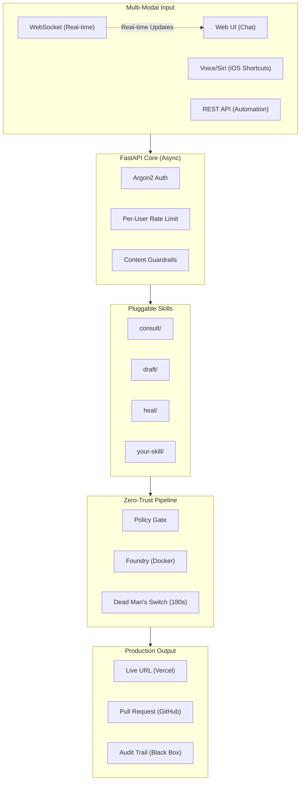

# Gantry

> **The Headless Fleet Protocol: From Abstract Intent to Production Systems**

[](https://github.com/YOUR_USERNAME/gantry/actions/workflows/ci.yml)
[](https://opensource.org/licenses/MIT)
[](https://www.python.org/downloads/)
[](https://fastapi.tiangolo.com/)
[](https://developer.mozilla.org/en-US/docs/Web/API/WebSocket)

**Gantry is the only open-source AI engineering platform that doesn't just generate code—it builds, tests, self-heals, deploys, and opens a PR for human review. All from a single voice command or chat message.**

---

## The Story Behind Gantry

The idea for Gantry started long before it had a name. I spent months thinking about what it would mean to have a truly autonomous local agent—one that could take an abstract idea, turn it into working software, deploy it, and still leave me in control as the final reviewer.

I was deep in the architecture when Cloudflare released [OpenClaw](https://github.com/cloudflare/moltworker). Seeing another team execute on a similar vision was a wake-up call. Rather than slow down, I accelerated. The difference became clear: OpenClaw is an excellent conversational agent. Gantry is a software factory.

OpenClaw talks. **Gantry ships.**

What you see here is the result of that acceleration—a production-grade system built with the lessons learned from studying the best in the industry, then going further. Gantry doesn't just generate code. It builds inside isolated containers, runs tests with self-healing, deploys to a live URL, and opens a Pull Request so you remain the approver.

This is the AI Staff Engineer I wanted. Now it exists.

---

## Why Gantry?

| Other AI Tools | Gantry |
|----------------|--------|
| Generate code snippets | **Deploy production apps** |
| Require manual testing | **Self-healing CI/CD** |
| Need copy-paste to run | **Live URL in 90 seconds** |
| No audit trail | **Black Box evidence** |
| Push directly | **PR workflow for oversight** |

---

## The Gantry Guarantee

| Guarantee | What It Means |
|-----------|---------------|
| **"No Touch" Build** | Code runs in isolated Docker containers—never on your host |
| **"Green Light" Deploy** | Only passing audits get deployed |
| **"Black Box" Evidence** | Every mission has cryptographic audit trail |
| **"Junior Dev" Model** | Never pushes to main—always opens a PR |

---

## Architecture Highlights



---

## What Makes Gantry Different

### vs. Other AI Code Generators

| Feature | GPT Engineer | Aider | Devin | **Gantry** |
|---------|--------------|-------|-------|------------|
| Open Source | Yes | Yes | No | Yes |
| Self-Hosted | Yes | Yes | No | Yes |
| Voice Input | No | No | No | Yes |
| **Deploys Code** | No | No | Yes | Yes |
| **Self-Healing** | No | No | Unknown | Yes |
| **PR Workflow** | No | No | No | Yes |
| **Audit Trail** | No | No | No | Yes |
| **WebSocket Updates** | No | No | Unknown | Yes |
| **Pluggable Skills** | No | No | No | Yes |

### vs. OpenClaw/Moltworker (Cloudflare)

| Aspect | OpenClaw | **Gantry** |
|--------|----------|------------|
| Purpose | Chat assistant | **Software factory** |
| Output | Conversations | **Deployed apps + PRs** |
| Self-Repair | No | Yes (3-retry healing loop) |
| Security Scan | No | Yes (Policy Gate) |
| Audit Evidence | No | Yes (Black Box) |
| Runtime | Edge (Cloudflare) | Docker (anywhere) |

---

## Tech Stack (v2.0 Architecture)

| Layer | Technology | Why This Choice |
|-------|------------|-----------------|
| **API** | FastAPI (async) | Non-blocking, WebSocket native, OpenAPI docs |
| **Real-time** | WebSocket | Instant build progress, no polling |
| **Auth** | Argon2 | Memory-hard hashing (replaces SHA256) |
| **Rate Limiting** | TokenBucket + IP | Per-user AND per-IP protection |
| **AI** | AWS Bedrock (Claude 3.5) | Enterprise-grade, IAM auth |
| **Prompts** | External `.md` files | Easy to customize, version controlled |
| **Skills** | Pluggable folder | Add capabilities without code changes |
| **Execution** | Docker (via proxy) | Zero-trust, least privilege |
| **Deploy** | Vercel CLI | Instant global CDN |
| **Publish** | GitHub API | PR workflow, never push to main |
| **Storage** | PostgreSQL | Mission history, connection pooled |

---

## Two Ways to Build

### Chat Mode (Interactive Consultation)

```
You: "Build me a task management app"

Gantry: "I can build that. Here is my plan:
         - Task CRUD with priorities
         - Due dates with calendar view  
         - Dark mode toggle
         - Local storage persistence
         
         Should I build a prototype with these features?"

You: "Yes, add drag-and-drop reordering too"

Gantry: "Starting build. Watch the progress..."

[WebSocket] ARCHITECTING > VALIDATING > BUILDING > DEPLOYING...

Gantry: "Live at https://task-app.vercel.app
         PR opened for review"
```

### Voice Mode (One-Shot Command)

```bash
# Via API
curl -X POST http://localhost:5050/gantry/architect \
  -H "Authorization: Bearer $TOKEN" \
  -d '{"voice_memo": "Build a calculator with dark mode"}'

# Response in 90 seconds
{
  "status": "DEPLOYED",
  "url": "https://calculator-abc.vercel.app",
  "pr_url": "https://github.com/you/repo/pull/42",
  "speech": "Calculator deployed. PR opened for review."
}
```

---

## Quick Start

### Prerequisites

- Docker Desktop
- Python 3.11+
- AWS Bedrock access (Claude 3.5 Sonnet)

### 1. Clone and Configure

```bash
git clone https://github.com/YOUR_USERNAME/gantry.git
cd gantry

# Create environment
cp .env.example .env
# Edit with your credentials
```

### 2. Start the Fleet

```bash
# Install dependencies
pip install -r requirements.txt

# Start services
docker-compose up -d

# Run Gantry (FastAPI)
python src/main_fastapi.py
```

### 3. Open the Console

```bash
open http://localhost:5050
```

Auto-generated API docs at `http://localhost:5050/docs`

---

## API Reference

### REST Endpoints

| Endpoint | Method | Description |
|----------|--------|-------------|
| `/` | GET | Web UI (Chat + Dashboard) |
| `/docs` | GET | OpenAPI documentation |
| `/health` | GET | Health check |
| `/gantry/auth` | POST | Authenticate, get token |
| `/gantry/chat` | POST | Chat with Architect |
| `/gantry/architect` | POST | Dispatch build mission |
| `/gantry/status/{id}` | GET | Get mission status |

### WebSocket (Real-time)

```javascript
// Connect to mission updates
const ws = new WebSocket(`ws://localhost:5050/gantry/ws/${missionId}`);

ws.onmessage = (event) => {
  const data = JSON.parse(event.data);
  // { type: "status", status: "BUILDING", message: "Running tests..." }
  updateProgress(data.status, data.message);
};
```

---

## Project Structure

```
gantry/
├── src/
│   ├── main_fastapi.py      # FastAPI with WebSocket
│   ├── core/
│   │   ├── architect.py     # AI brain
│   │   ├── auth_v2.py       # Argon2 + TokenBucket
│   │   ├── fleet_v2.py      # Orchestrator (split functions)
│   │   ├── foundry.py       # Docker execution
│   │   ├── policy.py        # Security gate
│   │   ├── deployer.py      # Vercel deployment
│   │   └── publisher.py     # GitHub PR
│   ├── skills/              # Pluggable capabilities
│   │   ├── __init__.py      # Skill registry
│   │   └── consult/         # Example skill
│   └── domain/
│       └── models.py        # Pydantic schemas
├── prompts/                 # External AI prompts
│   ├── system.md
│   ├── consult.md
│   └── heal.md
└── missions/                # Audit evidence
```

---

## Code Quality Standards

Gantry maintains enterprise-grade code quality:

| Metric | Standard | Gantry |
|--------|----------|--------|
| Max function length | 50 lines | All functions under 50 lines |
| Password hashing | Argon2/bcrypt | Argon2 |
| Rate limiting | Per-user | TokenBucket + IP |
| Real-time updates | WebSocket | Native WebSocket |
| API documentation | OpenAPI | Auto-generated |
| Prompt management | External | `prompts/*.md` |
| Skills extensibility | Plugin system | `skills/` folder |
| Type hints | 100% | All public APIs |
| Async support | Native | FastAPI async |

---

## Security Architecture

```
+-------------------------------------------------------------+
|                    CLOUDFLARE EDGE                           |
|                 (DDoS, WAF, Rate Limit)                      |
+-------------------------------------------------------------+
|                 FASTAPI (Async, Non-blocking)                |
|    +--------------+--------------+--------------+           |
|    | Argon2 Auth  | TokenBucket  |  Guardrails  |           |
|    | (memory-hard)| (per-user)   |  (content)   |           |
|    +--------------+--------------+--------------+           |
+-------------------------------------------------------------+
|                     POLICY GATE                              |
|           (Forbidden patterns, stack whitelist)              |
+-------------------------------------------------------------+
|                 DOCKER SOCKET PROXY                          |
|              (Least privilege, no dangerous ops)             |
+-------------------------------------------------------------+
|                    PROJECT POD                               |
|       (Isolated container, 512MB limit, 180s timeout)        |
+-------------------------------------------------------------+
```

---

## Adding Custom Skills

Create a new skill in `src/skills/`:

```
skills/
└── my-skill/
    ├── __init__.py
    ├── handler.py      # Skill implementation
    └── SKILL.md        # Documentation
```

```python
# handler.py
from src.skills import SkillResult

class MySkill:
    name = "my-skill"
    description = "What this skill does"

    async def execute(self, context: dict) -> SkillResult:
        # Your logic here
        return SkillResult(success=True, data={"result": "..."})

skill = MySkill()
```

Skills are auto-loaded at startup. No code changes to core required.

---

## Roadmap

- [x] FastAPI async architecture
- [x] WebSocket real-time updates
- [x] Argon2 password hashing
- [x] Per-user rate limiting
- [x] Externalized prompts
- [x] Pluggable skills system
- [ ] Multi-channel (Slack, Discord, Telegram)
- [ ] OAuth/OIDC authentication
- [ ] Redis session store
- [ ] Browser automation (Playwright)
- [ ] Streaming AI responses

---

## Documentation

- [ARCHITECTURE.md](./ARCHITECTURE.md) - Technical deep-dive, sequence diagrams
- [RUNBOOK.md](./RUNBOOK.md) - Setup, configuration, troubleshooting
- [CONTRIBUTING.md](./CONTRIBUTING.md) - How to contribute and add skills

---

## Sponsorship

Gantry is open-source and free. If you find it valuable:

| Tier | Monthly | Benefits |
|------|---------|----------|
| Supporter | $5 | Name in README |
| Builder | $25 | Priority issues |
| Architect | $100 | Monthly roadmap call |
| Fleet Commander | $500 | Custom skill development |

[Become a Sponsor](https://github.com/sponsors/YOUR_USERNAME)

---

## License

MIT License - see [LICENSE](./LICENSE)

---

<p align="center">
  <strong>Gantry</strong> - Your AI Staff Engineer
  <br><br>
  <em>You describe. Gantry ships.</em>
  <br><br>
  Voice > AI > Docker > Deploy > PR
</p>
