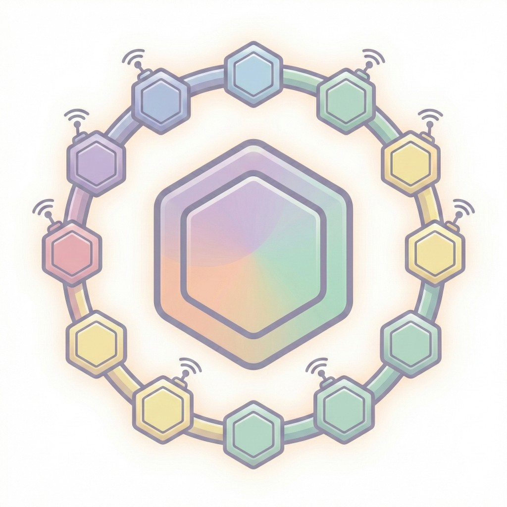
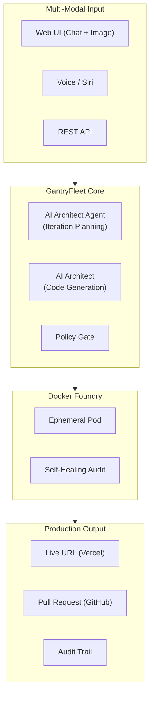

#  GantryFleet

> **The Headless Software Factory: From Voice to Production in 90 Seconds**

[](https://opensource.org/licenses/Apache-2.0)
[](https://www.python.org/downloads/)
[](https://fastapi.tiangolo.com/)
[](https://gantryfleet.ai)

> **"You don't write code. You direct the fleet."**

**GantryFleet** is a local, voice-activated software factory. It transforms natural language (and optional design mockups) into deployed, tested applications—complete with GitHub Pull Requests for human review. It doesn't generate code snippets; it **ships production systems**.

---

## Why GantryFleet?

| Other AI Tools | GantryFleet |
|----------------|-------------|
| Generate code snippets | **Deploy production apps** |
| Require manual testing | **Self-healing CI/CD (3 retries)** |
| Need copy-paste to run | **Live URL in 90 seconds** |
| No audit trail | **Black Box evidence** |
| Push directly to main | **PR workflow for oversight** |
| Single-shot generation | **AI Architect Consultation** |
| Text-only input | **Text + Design Image input** |

---

## The GantryFleet Guarantee

| Guarantee | What It Means |
|-----------|---------------|
| **"No Touch" Build** | Code runs in isolated Docker containers—never on your host |
| **"Green Light" Deploy** | Only passing audits get deployed |
| **"Black Box" Evidence** | Every mission has cryptographic audit trail |
| **"Junior Dev" Model** | Never pushes to main—always opens a PR |

---

## Key Capabilities

### 1. AI Architect Consultation
GantryFleet doesn't guess. The **AI Architect Agent** analyzes your request, proposes a plan, asks clarifying questions, and breaks complex projects into **iterations** before building.

```
You: "Build me a LinkedIn-style professional network"

GantryFleet (AI Architect): "This is a 3-iteration project:
  • Iteration 1 (NOW): Core UI with mock profiles, feed layout
  • Iteration 2 (LATER): Authentication + real user data
  • Iteration 3 (LATER): Messaging + connections
  
  Shall I start with Iteration 1?"

You: "Yes, proceed"

[WebSocket] ARCHITECTING → BUILDING → DEPLOYING...

GantryFleet: "Live at https://linkedin-clone.vercel.app — PR opened."
```

### 2. Design Mockup Matching (95% Visual Fidelity)
Upload a screenshot, mockup, or sketch along with your request. GantryFleet's **Vision-enabled Architect** analyzes the image and replicates it with **95% visual accuracy**:

- **Layout:** Exact column/row structure and spacing
- **Colors:** Precise hex values extracted from the image
- **Typography:** Font sizes, weights, and line-heights
- **Components:** Button styles, input fields, cards, shadows
- **Polish:** Hover states, transitions, border-radius

The generated repo includes your mockup in the README as a "Design Reference."

### 3. Famous App Design Systems
Tell GantryFleet to "build something like LinkedIn" and it applies the **exact design system**—colors, fonts, layouts—from our `FAMOUS_THEMES` database.

Supported themes: `LINKEDIN`, `TWITTER`, `INSTAGRAM`, `FACEBOOK`, `SLACK`, `SPOTIFY`, `NOTION`, `AIRBNB`

### 4. 3-Tier Model Architecture (Never Fail on Simple Apps)
GantryFleet uses a **multi-model fallback** strategy to maximize success rate:

| Tier | Model | Purpose |
|------|-------|---------|
| **Tier 1** | Claude 4 Sonnet | Most capable, handles complex apps |
| **Tier 2** | Claude 4 Sonnet | Balanced performance, reliable |
| **Tier 3** | Claude 3.5 Sonnet | Battle-tested, production-proven |

**Result:** Simple apps NEVER fail. Complex apps get 3 chances with progressively different models.

### 5. Zero-Trust Fabrication
- **Isolation:** Every build happens in an ephemeral Docker Pod (512MB RAM, 180s timeout)
- **Self-Healing:** If tests fail, the Architect analyzes logs and retries (up to 3x)
- **Policy Gate:** Scans for secrets, forbidden patterns, and security issues

### 6. Real-Time WebSocket Updates
Subscribe to `WS /gantry/ws/{mission_id}` for live status: `ARCHITECTING → BUILDING → DEPLOYING → DEPLOYED`

---

## Quick Start

### Prerequisites
- Docker Desktop
- Python 3.11+
- AWS Bedrock access (Claude 3.5 Sonnet)
- Vercel & GitHub tokens

### 1. Clone and Configure

```bash
git clone https://github.com/YOUR_USERNAME/gantry.git
cd gantry
cp .env.example .env
# Edit .env with your credentials
```

### 2. Start the Fleet

```bash
# Start all services
docker-compose up -d

# Or run locally for development
pip install -r requirements.txt
uvicorn src.main_fastapi:app --host 0.0.0.0 --port 5050
```

### 3. Open the Console

```bash
open http://localhost:5050       # Web UI
open http://localhost:5050/docs  # OpenAPI docs
```

### 4. Build Something

```bash
# Via API
curl -X POST http://localhost:5050/gantry/voice \
  -H "Content-Type: application/json" \
  -d '{"message": "Build a todo list app with dark mode"}'

# Or use the Web UI at http://localhost:5050
```

---

## Tech Stack

| Layer | Technology | Why |
|-------|------------|-----|
| **API** | FastAPI (async) | Non-blocking, WebSocket native |
| **Auth** | Argon2 + TokenBucket | Memory-hard hashing, per-user rate limiting |
| **AI** | AWS Bedrock (Claude 3.5) | AI Architect Agent |
| **Execution** | Docker (via proxy) | Zero-trust isolation |
| **Deploy** | Vercel CLI | Instant global CDN |
| **Publish** | GitHub API | PR workflow, never push to main |
| **Storage** | PostgreSQL | Missions, conversations, audit trail |

---

## Architecture Overview


<details>
<summary>View as Mermaid Diagram</summary>



</details>

---

## What's Built vs. What's Planned

### ✅ Production Ready

**Watch the Demo:** [Download Demo Video](assets/Demo.mov)

<!-- To embed video: Upload Demo.mov to a GitHub Issue/Discussion, then paste the generated URL here -->
<!-- Example: https://github.com/user-attachments/assets/your-video-id -->

- AI Architect Consultation with iteration planning
- Self-healing builds (3 retry attempts)
- Zero-trust Docker isolation
- Vercel deployment with live URLs
- GitHub PR workflow (never pushes to main)
- Famous app clone themes (LinkedIn, Twitter, etc.)
- Design image input (mockups included in repo)
- WebSocket real-time updates
- Argon2 authentication + TokenBucket rate limiting
- Professional UI generation (Staff Engineer quality)

### 🔮 Roadmap (Future Iterations)

These features are in the research/planning phase. **For early access or enterprise engagement, contact the author.**

| Feature | Description | Status |
|---------|-------------|--------|
| **Multi-Agent Architecture** | Fractal agents that spawn sub-agents | Subscription |
| **Vector Memory** | Persistent embeddings (Supabase/Pinecone) | Subscription |
| **Temporal Orchestration** | Workflow engine for complex builds | Subscription |
| **arc-core-sdk Injection** | Generated apps include internal agents | Subscription |
| **Multi-Channel** | Slack, Discord, Telegram integration | Subscription |
| **OAuth/OIDC** | Enterprise SSO support | Subscription |

---

## Enterprise & Advanced Engagement

GantryFleet is open-source under **Apache 2.0**—free for personal and commercial use.

**For advanced features, custom integrations, or enterprise deployment:**

📧 **Contact:** [pramod.voola@gmail.com](mailto:pramod.voola@gmail.com)  
👤 **Author:** Pramod Kumar Voola

| Engagement | Description |
|------------|-------------|
| **Subscription** | Priority support, custom themes, dedicated infrastructure |
| **Enterprise** | On-premise deployment, SSO integration, SLA |
| **Custom Development** | Multi-agent architecture, vector memory, custom skills |

---

## API Reference

### Core Endpoints

| Endpoint | Method | Description |
|----------|--------|-------------|
| `/` | GET | Web UI |
| `/health` | GET | Health check |
| `/docs` | GET | OpenAPI documentation |

### Consultation Loop

| Endpoint | Method | Description |
|----------|--------|-------------|
| `/gantry/voice` | POST | Start/continue consultation |
| `/gantry/status/{id}` | GET | Get mission status |
| `/gantry/missions` | GET | List all missions |

### WebSocket

| Endpoint | Description |
|----------|-------------|
| `WS /gantry/ws/{id}` | Real-time mission updates |

Full API documentation at `/docs` when running locally.

---

## Security

- **Docker Proxy:** No direct socket access (`tcp://docker-proxy:2375`)
- **Pod Limits:** 512MB RAM, 50% CPU, 180s timeout
- **Policy Gate:** Scans for secrets, forbidden patterns
- **Audit Trail:** Every build recorded in `missions/`

---

## Contributing

See [CONTRIBUTING.md](./CONTRIBUTING.md) for guidelines.

---

## License

Licensed under **Apache License 2.0**—the same license used by Kubernetes, Terraform, and Swift.

- ✅ Free for personal and commercial use
- ✅ Safe for enterprise adoption
- ✅ Patent rights granted
- ✅ Trademark protected

See [LICENSE](./LICENSE) for details.

---

<p align="center">
  <strong>GantryFleet</strong> — The Headless Software Factory
  <br><br>
  <em>Voice → AI → Docker → Deploy → PR</em>
  <br><br>
  Built by <a href="mailto:pramod.voola@gmail.com">Pramod Kumar Voola</a>
</p>
