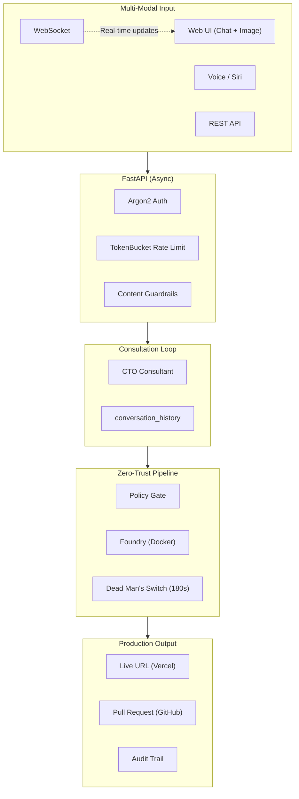

#  Gantry

> **The Headless Fleet Protocol: From Abstract Intent to Production Systems**

[](https://opensource.org/licenses/MIT)
[](https://www.python.org/downloads/)
[](https://fastapi.tiangolo.com/)
[](https://developer.mozilla.org/en-US/docs/Web/API/WebSocket)

**Gantry is the only open-source AI engineering platform that doesn't just generate code—it builds, tests, self-heals, deploys, and opens a PR for human review. All from a single voice command or chat message.**

---

## The Story Behind Gantry

The vision for Gantry predates its name. I spent months architecting a solution for a singular problem: How do we build a truly autonomous agent that takes an idea from concept to deployment without removing the engineer from the driver's seat?

When Cloudflare released [OpenClaw](https://github.com/cloudflare/moltworker), it wasn't a deterrent—it was a wake-up call. It clarified the market gap. While others were building excellent conversational assistants, we realized the industry didn't need more chat bots; it needed builders. OpenClaw talks. **Gantry ships.**

What you see today is a production-grade system forged from that realization. Gantry operates as an isolated software factory—building in containers, running self-healing tests, and deploying to live URLs—all before handing you a clean Pull Request for approval.

I wanted an AI Staff Engineer. I built Gantry.

---

## Why Gantry?

| Other AI Tools | Gantry |
|----------------|--------|
| Generate code snippets | **Deploy production apps** |
| Require manual testing | **Self-healing CI/CD** |
| Need copy-paste to run | **Live URL in 90 seconds** |
| No audit trail | **Black Box evidence** |
| Push directly | **PR workflow for oversight** |

---

## The Gantry Guarantee

| Guarantee | What It Means |
|-----------|---------------|
| **"No Touch" Build** | Code runs in isolated Docker containers—never on your host |
| **"Green Light" Deploy** | Only passing audits get deployed |
| **"Black Box" Evidence** | Every mission has cryptographic audit trail |
| **"Junior Dev" Model** | Never pushes to main—always opens a PR |

---

## Architecture Highlights (V7.0 - 2026)



**Real-time updates via WebSocket** (`/gantry/ws/{id}`) or polling (`/gantry/status/{id}`).

---

## What Makes Gantry Different

### vs. Other AI Code Generators

| Feature | GPT Engineer | Aider | Devin | **Gantry** |
|---------|--------------|-------|-------|------------|
| Open Source | Yes | Yes | No | **Yes** |
| Self-Hosted | Yes | Yes | No | **Yes** |
| Voice Input | No | No | No | **Yes** |
| **Deploys Code** | No | No | Yes | **Yes** |
| **Self-Healing** | No | No | Unknown | **Yes** |
| **PR Workflow** | No | No | No | **Yes** |
| **Audit Trail** | No | No | No | **Yes** |
| **WebSocket Real-time** | No | No | Unknown | **Yes** |
| **Consultation Loop** | No | No | No | **Yes** |
| **Design Image Input** | No | No | No | **Yes** |

### vs. OpenClaw/Moltworker (Cloudflare)

| Aspect | OpenClaw | **Gantry** |
|--------|----------|------------|
| Purpose | Chat assistant | **Software factory** |
| Output | Conversations | **Deployed apps + PRs** |
| Self-Repair | No | Yes (3-retry healing loop) |
| Security Scan | No | Yes (Policy Gate) |
| Audit Evidence | No | Yes (Black Box) |
| Runtime | Edge (Cloudflare) | Docker (anywhere) |

---

## Tech Stack (V7.0 - 2026 Architecture)

| Layer | Technology | Why This Choice |
|-------|------------|-----------------|
| **API** | FastAPI (async) | Non-blocking, WebSocket native, OpenAPI docs |
| **Real-time** | WebSocket | Instant build progress, no polling needed |
| **Auth** | Argon2 + TokenBucket | Memory-hard hashing, per-user rate limiting |
| **AI** | AWS Bedrock (Claude 3.5) | Architect + Consultant; IAM auth |
| **Execution** | Docker (via proxy) | Zero-trust; `tcp://docker-proxy:2375` |
| **Deploy** | Vercel CLI | Instant global CDN |
| **Publish** | GitHub API | PR workflow, never push to main |
| **Storage** | PostgreSQL | Missions, conversation_history, design_target |

---

## Two Ways to Build

### Consultation Mode (Primary: Voice / Chat)

Multi-turn flow: CTO proposes a plan, asks questions, then builds when you confirm.

```
You: "Build me a task management app"  (optionally attach a design image)

Gantry (CTO): "I can build that. Here is my plan:
               - Task CRUD with priorities
               - Due dates with calendar view
               - Dark mode toggle
               - Local storage persistence
               Should I build a prototype with these features?"

You: "Yes, proceed"

[WebSocket] ARCHITECTING → BUILDING → DEPLOYING...

Gantry: "Live at https://task-app.vercel.app — PR opened for review."
```

```bash
# Start or continue consultation
curl -X POST http://localhost:5050/gantry/voice \
  -H "Authorization: Bearer $TOKEN" \
  -H "Content-Type: application/json" \
  -d '{"message": "Build a LinkedIn-style feed", "deploy": true, "publish": true}'

# Optional: attach design image (base64 + filename)
# -d '{"message": "Build this layout", "image_base64": "...", "image_filename": "mockup.png"}'
```

### Direct Build (Bypass Consultation)

Single-shot build: no CTO loop. Use for automation or when the request is already precise.

```bash
curl -X POST http://localhost:5050/gantry/architect \
  -H "Authorization: Bearer $TOKEN" \
  -H "Content-Type: application/json" \
  -d '{"voice_memo": "Build a calculator with dark mode", "deploy": true, "publish": true}'

# 202 { "mission_id": "...", "speech": "Gantry assumes control." }

# Subscribe to WebSocket for real-time updates
# ws://localhost:5050/gantry/ws/{mission_id}
```

---

## Building Complex Apps & Big Website Prototypes

Gantry generates **working prototypes** with a minimal data layer (localStorage + serverless API). **ORM and database connections are not supported in generated code** by design (no DB in the build or on Vercel). Big-website-style UIs are supported; for production you add DB + ORM after the fact.

**To use Gantry for building complex apps, production-ready backends, or custom engagements:** reach out for subscription engagement.

**Pramod.Voola@gmail.com**

---

## Quick Start

### Prerequisites

- Docker Desktop
- Python 3.11+
- AWS Bedrock access (Claude 3.5 Sonnet)

### 1. Clone and Configure

```bash
git clone https://github.com/YOUR_USERNAME/gantry.git
cd gantry

# Create environment
cp .env.example .env
# Edit with your credentials
```

### 2. Start the Fleet

```bash
# Install dependencies
pip install -r requirements.txt

# Start services
docker-compose up -d

# Gantry starts automatically with FastAPI
# Or run manually for development:
uvicorn src.main_fastapi:app --host 0.0.0.0 --port 5050

# Legacy Flask (if needed):
# python src/main.py
```

### 3. Open the Console

```bash
open http://localhost:5050

# OpenAPI docs
open http://localhost:5050/docs
```

### Clear projects from the database

- **From the UI**: Projects panel → **Clear all** (requires login)
- **From the CLI**:
  ```bash
  python scripts/clear_missions.py
  ```

---

## API Reference (V7.0)

### Core Endpoints

| Endpoint | Method | Description |
|----------|--------|-------------|
| `/` | GET | Web UI |
| `/health` | GET | Enhanced health check (uptime, connections) |
| `/ready` | GET | Kubernetes/Docker readiness probe |
| `/docs` | GET | OpenAPI documentation |

### Authentication

| Endpoint | Method | Description |
|----------|--------|-------------|
| `/gantry/auth` | POST | Authenticate (password) |
| `/gantry/auth/status` | GET | Check session validity |

### V6.5 Consultation Loop

| Endpoint | Method | Description |
|----------|--------|-------------|
| `/gantry/voice` | POST | **Primary**: Start/continue consultation |
| `/gantry/consult` | POST | Alias for /voice |
| `/gantry/consultation/{id}` | GET | Get consultation state |
| `/gantry/themes` | GET | List famous-app themes |

### Build & Status

| Endpoint | Method | Description |
|----------|--------|-------------|
| `/gantry/architect` | POST | Direct build (bypasses consultation) |
| `/gantry/chat` | POST | Chat with Architect |
| `/gantry/status/{id}` | GET | Get mission status |
| `/gantry/latest` | GET | Latest mission |
| `/gantry/missions` | GET | List all missions |

### Mission Management

| Endpoint | Method | Description |
|----------|--------|-------------|
| `/gantry/missions/clear` | POST | Clear all projects |
| `/gantry/missions/{id}/retry` | POST | Retry failed mission |
| `/gantry/missions/{id}/failure` | GET | Get failure details |
| `/gantry/search` | GET | Search missions |

### WebSocket

| Endpoint | Description |
|----------|-------------|
| `WS /gantry/ws/{id}` | Real-time mission updates |

---

## Project Structure

```
gantry/
├── src/
│   ├── main_fastapi.py      # FastAPI API (V7.0 primary)
│   ├── main.py              # Legacy Flask (optional)
│   ├── core/
│   │   ├── architect.py     # AI Architect + FAMOUS_THEMES
│   │   ├── consultant.py    # CTO Consultant (consultation loop)
│   │   ├── fleet_v2.py      # Fleet Manager v2 (async, WebSocket)
│   │   ├── fleet.py         # Legacy Fleet (thread-based)
│   │   ├── auth_v2.py       # Argon2 auth, TokenBucket
│   │   ├── auth.py          # Legacy auth (SHA256)
│   │   ├── db.py            # Missions, conversation_history
│   │   ├── foundry.py       # Docker build
│   │   ├── policy.py        # Security gate
│   │   ├── deployer.py      # Vercel deployment
│   │   └── publisher.py     # GitHub PR
│   ├── skills/              # Pluggable skills
│   └── domain/
│       └── models.py        # Pydantic schemas
├── prompts/                 # Externalized AI prompts
└── missions/                # Audit evidence
```

---

## Code Quality Standards

| Metric | Standard | Gantry |
|--------|----------|--------|
| Max function length | 50 lines | All functions under 50 lines |
| Auth | Modern hashing | Argon2 (memory-hard) |
| Rate limiting | Per-user | TokenBucket + per-IP |
| Status updates | Real-time | WebSocket + polling fallback |
| Type hints | 100% | Pydantic + type hints |
| API docs | Auto-generated | OpenAPI at /docs |

---

## Security Architecture

```
+-------------------------------------------------------------+
|                    CLOUDFLARE EDGE (optional)               |
|                 (DDoS, WAF, Rate Limit)                     |
+-------------------------------------------------------------+
|                 FASTAPI API (V7.0)                          |
|    +--------------+--------------+--------------+           |
|    | Argon2 Auth  | TokenBucket  |  Guardrails  |           |
|    | (password)   | (per-user)   |  (content)   |           |
|    +--------------+--------------+--------------+           |
+-------------------------------------------------------------+
|                     POLICY GATE                             |
|           (Forbidden patterns, stack whitelist)             |
+-------------------------------------------------------------+
|                 DOCKER PROXY (tcp://docker-proxy:2375)      |
|              (Least privilege, no socket access)            |
+-------------------------------------------------------------+
|                    PROJECT POD                              |
|    (Isolated container, 512MB limit, 50% CPU, 180s timeout) |
+-------------------------------------------------------------+
```

---

## Roadmap

- [x] V7.0 FastAPI async architecture
- [x] WebSocket real-time updates
- [x] V6.5 consultation loop (CTO Consultant)
- [x] Design image capture and inclusion in repo
- [x] Famous-app themes (clone mode)
- [x] Argon2 auth + TokenBucket rate limiting
- [x] Enhanced health/readiness probes
- [ ] Multi-channel (Slack, Discord, Telegram)
- [ ] OAuth/OIDC authentication
- [ ] Redis session store
- [ ] Browser automation (Playwright)
- [ ] Streaming AI responses
- [ ] OpenTelemetry observability

---

## Documentation

- [ARCHITECTURE.md](./ARCHITECTURE.md) - Technical deep-dive, sequence diagrams
- [RUNBOOK.md](./RUNBOOK.md) - Setup, configuration, troubleshooting
- [CONTRIBUTING.md](./CONTRIBUTING.md) - How to contribute and add skills

---

## Sponsorship

Gantry is open-source and free. If you find it valuable:

| Tier | Monthly | Benefits |
|------|---------|----------|
| Supporter | $5 | Name in README |
| Builder | $25 | Priority issues |
| Architect | $100 | Monthly roadmap call |
| Fleet Commander | $500 | Custom skill development |

[Become a Sponsor](https://github.com/sponsors/YOUR_USERNAME)

---

## License

MIT License - see [LICENSE](./LICENSE)

---

<p align="center">
  <strong>Gantry</strong> - Your AI Staff Engineer
  <br><br>
  <em>You describe. Gantry ships.</em>
  <br><br>
  Voice > AI > Docker > Deploy > PR
</p>
