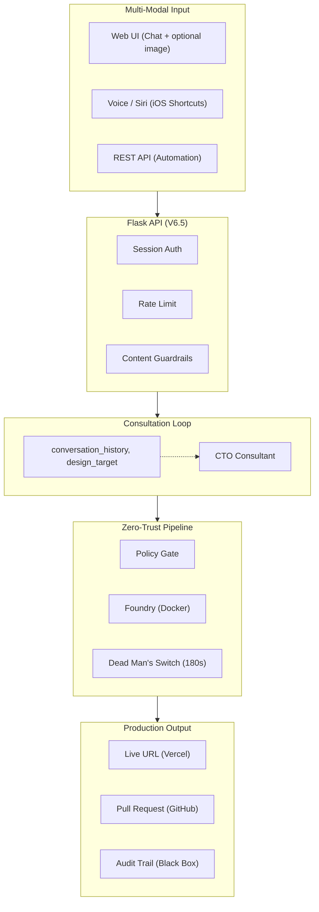

#  Gantry

> **The Headless Fleet Protocol: From Abstract Intent to Production Systems**

[](https://opensource.org/licenses/MIT)
[](https://www.python.org/downloads/)
[](https://flask.palletsprojects.com/)

**Gantry is the only open-source AI engineering platform that doesn't just generate code—it builds, tests, self-heals, deploys, and opens a PR for human review. All from a single voice command or chat message.**

---

## The Story Behind Gantry

The vision for Gantry predates its name. I spent months architecting a solution for a singular problem: How do we build a truly autonomous agent that takes an idea from concept to deployment without removing the engineer from the driver's seat?

When Cloudflare released [OpenClaw](https://github.com/cloudflare/moltworker), it wasn't a deterrent—it was a wake-up call. It clarified the market gap. While others were building excellent conversational assistants, we realized the industry didn't need more chat bots; it needed builders. OpenClaw talks. **Gantry ships.**

What you see today is a production-grade system forged from that realization. Gantry operates as an isolated software factory—building in containers, running self-healing tests, and deploying to live URLs—all before handing you a clean Pull Request for approval.

I wanted an AI Staff Engineer. I built Gantry.

---

## Why Gantry?

| Other AI Tools | Gantry |
|----------------|--------|
| Generate code snippets | **Deploy production apps** |
| Require manual testing | **Self-healing CI/CD** |
| Need copy-paste to run | **Live URL in 90 seconds** |
| No audit trail | **Black Box evidence** |
| Push directly | **PR workflow for oversight** |

---

## The Gantry Guarantee

| Guarantee | What It Means |
|-----------|---------------|
| **"No Touch" Build** | Code runs in isolated Docker containers—never on your host |
| **"Green Light" Deploy** | Only passing audits get deployed |
| **"Black Box" Evidence** | Every mission has cryptographic audit trail |
| **"Junior Dev" Model** | Never pushes to main—always opens a PR |

---

## Architecture Highlights



Status updates: poll `GET /gantry/status/{id}` or `GET /gantry/consultation/{id}`.

---

## What Makes Gantry Different

### vs. Other AI Code Generators

| Feature | GPT Engineer | Aider | Devin | **Gantry** |
|---------|--------------|-------|-------|------------|
| Open Source | Yes | Yes | No | Yes |
| Self-Hosted | Yes | Yes | No | Yes |
| Voice Input | No | No | No | Yes |
| **Deploys Code** | No | No | Yes | Yes |
| **Self-Healing** | No | No | Unknown | Yes |
| **PR Workflow** | No | No | No | Yes |
| **Audit Trail** | No | No | No | Yes |
| **Consultation Loop** | No | No | No | Yes (CTO propose → confirm → build) |
| **Design Image Input** | No | No | No | Yes (saved and included in repo) |

### vs. OpenClaw/Moltworker (Cloudflare)

| Aspect | OpenClaw | **Gantry** |
|--------|----------|------------|
| Purpose | Chat assistant | **Software factory** |
| Output | Conversations | **Deployed apps + PRs** |
| Self-Repair | No | Yes (3-retry healing loop) |
| Security Scan | No | Yes (Policy Gate) |
| Audit Evidence | No | Yes (Black Box) |
| Runtime | Edge (Cloudflare) | Docker (anywhere) |

---

## Tech Stack (V6.5)

| Layer | Technology | Why This Choice |
|-------|------------|-----------------|
| **API** | Flask (primary) | V6.5 consultation loop; optional FastAPI for async/WebSocket |
| **Consultation** | CTO Consultant (Bedrock) | Multi-turn: propose → question → confirm → build |
| **Auth** | Session + password (SHA256) | Simple, env-based; optional Argon2 in FastAPI path |
| **Rate Limiting** | Per-IP | Guardrails + rate limit |
| **AI** | AWS Bedrock (Claude 3.5) | Architect + Consultant; IAM auth |
| **Execution** | Docker (via proxy) | Zero-trust; `tcp://docker-proxy:2375` |
| **Deploy** | Vercel CLI | Instant global CDN |
| **Publish** | GitHub API | PR workflow, never push to main |
| **Storage** | PostgreSQL | Missions, conversation_history, design_target |

---

## Two Ways to Build

### Consultation Mode (Primary: Voice / Chat)

Multi-turn flow: CTO proposes a plan, asks questions, then builds when you confirm. Optional design image is saved and included in the built repo.

```
You: "Build me a task management app"  (optionally attach a design image)

Gantry (CTO): "I can build that. Here is my plan:
               - Task CRUD with priorities
               - Due dates with calendar view
               - Dark mode toggle
               - Local storage persistence
               Should I build a prototype with these features?"

You: "Yes, proceed"

Gantry: "Clone protocol initiated." (202)

# Poll status: GET /gantry/status/{mission_id} or /gantry/consultation/{mission_id}
# When status is DEPLOYED / SUCCESS:
Gantry: Live at https://task-app.vercel.app — PR opened for review.
```

```bash
# Start or continue consultation
curl -X POST http://localhost:5050/gantry/voice \
  -H "Cookie: session=..." \
  -H "Content-Type: application/json" \
  -d '{"message": "Build a LinkedIn-style feed", "deploy": true, "publish": true}'

# Optional: attach design image (base64 + filename)
# -d '{"message": "Build this layout", "image_base64": "...", "image_filename": "mockup.png"}'
```

### Direct Build (Bypass Consultation)

Single-shot build: no CTO loop. Use for automation or when the request is already precise.

```bash
curl -X POST http://localhost:5050/gantry/architect \
  -H "Cookie: session=..." \
  -H "Content-Type: application/json" \
  -d '{"voice_memo": "Build a calculator with dark mode", "deploy": true, "publish": true}'

# 202 { "mission_id": "...", "speech": "Gantry assumes control." }
# Poll GET /gantry/status/{mission_id} or GET /gantry/latest for url and pr_url
```

---

## Building Complex Apps & Big Website Prototypes

Gantry generates **working prototypes** with a minimal data layer (localStorage + serverless API). **ORM and database connections are not supported in generated code** by design (no DB in the build or on Vercel). Big-website-style UIs are supported; for production you add DB + ORM after the fact.

**To use Gantry for building complex apps, production-ready backends, or custom engagements:** reach out for subscription engagement. Contact the author to convert this critic into real business:

**Pramod.Voola@gmail.com**

---

## Quick Start

### Prerequisites

- Docker Desktop
- Python 3.11+
- AWS Bedrock access (Claude 3.5 Sonnet)

### 1. Clone and Configure

```bash
git clone https://github.com/YOUR_USERNAME/gantry.git
cd gantry

# Create environment
cp .env.example .env
# Edit with your credentials
```

### 2. Start the Fleet

```bash
# Install dependencies
pip install -r requirements.txt

# Start services
docker-compose up -d

# Run Gantry (Flask — V6.5 default)
python src/main.py
# Optional: FastAPI + WebSocket — python src/main_fastapi.py
```

### 3. Open the Console

```bash
open http://localhost:5050
```

For OpenAPI docs, run the optional FastAPI app: `python src/main_fastapi.py` then open `http://localhost:5050/docs`

### Clear projects from the database

- **From the UI**: Projects panel → **Clear all** (requires login). The list clears immediately; the DB is updated.
- **From the CLI** (if UI clear fails or to verify): From project root, run:
  ```bash
  python scripts/clear_missions.py
  ```
  This deletes all rows from the `missions` table. Mission folders under `missions/` are kept for audit. Then refresh the browser or click **Refresh** in the Projects panel.

---

## API Reference

### REST Endpoints (Flask — V6.5)

| Endpoint | Method | Description |
|----------|--------|-------------|
| `/` | GET | Web UI (Chat + optional image, Dashboard) |
| `/health` | GET | Health check |
| `/gantry/auth` | POST | Authenticate (password), session cookie |
| `/gantry/auth/status` | GET | Check auth status |
| `/gantry/voice` | POST | **Primary**: Consultation loop (message, optional image_base64, image_filename) |
| `/gantry/consult` | POST | Same as voice; returns richer consultation state |
| `/gantry/consultation/<id>` | GET | Get consultation state (conversation_history, pending_question, design_target) |
| `/gantry/themes` | GET | List famous-app themes (clone mode) |
| `/gantry/chat` | POST | Architectural Q&A (no build) |
| `/gantry/architect` | POST | Direct build (voice_memo; bypasses consultation) |
| `/gantry/status/<id>` | GET | Get mission status (url, pr_url, speech) |
| `/gantry/latest` | GET | Latest mission status |
| `/gantry/missions` | GET | List recent missions |

Status updates: poll `GET /gantry/status/{id}` or `GET /gantry/consultation/{id}`. For real-time updates, use the optional FastAPI app (`src/main_fastapi.py`) and WebSocket `/gantry/ws/{id}`.

---

## Project Structure

```
gantry/
├── src/
│   ├── main.py              # Flask API (V6.5 primary)
│   ├── main_fastapi.py      # Optional: FastAPI + WebSocket
│   ├── core/
│   │   ├── architect.py     # AI Architect + FAMOUS_THEMES (clone mode)
│   │   ├── consultant.py   # CTO Consultant (consultation loop)
│   │   ├── fleet.py        # Fleet Manager (orchestrator)
│   │   ├── auth.py         # Session auth, rate limit, guardrails
│   │   ├── db.py           # Missions, conversation_history, design_target
│   │   ├── foundry.py      # Docker build; injects design-reference image
│   │   ├── policy.py       # Security gate
│   │   ├── deployer.py     # Vercel deployment
│   │   └── publisher.py    # GitHub PR
│   ├── skills/             # Optional: pluggable skills (FastAPI path)
│   └── domain/
│       └── models.py       # Pydantic schemas
└── missions/                # Audit evidence; design-reference images
```

---

## Code Quality Standards

Gantry maintains enterprise-grade code quality:

| Metric | Standard | Gantry |
|--------|----------|--------|
| Max function length | 50 lines | All functions under 50 lines |
| Auth | Session + password | SHA256 env hash (optional Argon2 in FastAPI path) |
| Rate limiting | Per-IP | Rate limit + guardrails |
| Status updates | Polling or WebSocket | Poll `/gantry/status` or `/gantry/consultation`; optional WebSocket via FastAPI |
| Type hints | 100% | Pydantic + type hints |
| Consultation | Multi-turn | CTO Consultant (V6.5) |

---

## Security Architecture

```
+-------------------------------------------------------------+
|                    CLOUDFLARE EDGE (optional)                |
|                 (DDoS, WAF, Rate Limit)                      |
+-------------------------------------------------------------+
|                 FLASK API (V6.5)                              |
|    +--------------+--------------+--------------+           |
|    | Session Auth | Rate Limit   |  Guardrails  |           |
|    | (password)   | (per-IP)     |  (content)   |           |
|    +--------------+--------------+--------------+           |
+-------------------------------------------------------------+
|                     POLICY GATE                              |
|           (Forbidden patterns, stack whitelist)              |
+-------------------------------------------------------------+
|                 DOCKER PROXY (tcp://docker-proxy:2375)       |
|              (Least privilege, no socket access)             |
+-------------------------------------------------------------+
|                    PROJECT POD                               |
|       (Isolated container, 512MB limit, 180s timeout)        |
+-------------------------------------------------------------+
```

---

## Adding Custom Skills

Create a new skill in `src/skills/`:

```
skills/
└── my-skill/
    ├── __init__.py
    ├── handler.py      # Skill implementation
    └── SKILL.md        # Documentation
```

```python
# handler.py
from src.skills import SkillResult

class MySkill:
    name = "my-skill"
    description = "What this skill does"

    async def execute(self, context: dict) -> SkillResult:
        # Your logic here
        return SkillResult(success=True, data={"result": "..."})

skill = MySkill()
```

Skills are auto-loaded at startup. No code changes to core required.

---

## Roadmap

- [x] V6.5 consultation loop (CTO Consultant)
- [x] Design image capture and inclusion in repo
- [x] Famous-app themes (clone mode)
- [x] Flask primary API; optional FastAPI + WebSocket
- [x] Self-healing build (up to 3 retries)
- [ ] Multi-channel (Slack, Discord, Telegram)
- [ ] OAuth/OIDC authentication
- [ ] Redis session store
- [ ] Browser automation (Playwright)
- [ ] Streaming AI responses

---

## Documentation

- [ARCHITECTURE.md](./ARCHITECTURE.md) - Technical deep-dive, sequence diagrams
- [RUNBOOK.md](./RUNBOOK.md) - Setup, configuration, troubleshooting
- [CONTRIBUTING.md](./CONTRIBUTING.md) - How to contribute and add skills

---

## Sponsorship

Gantry is open-source and free. If you find it valuable:

| Tier | Monthly | Benefits |
|------|---------|----------|
| Supporter | $5 | Name in README |
| Builder | $25 | Priority issues |
| Architect | $100 | Monthly roadmap call |
| Fleet Commander | $500 | Custom skill development |

[Become a Sponsor](https://github.com/sponsors/YOUR_USERNAME)

---

## License

MIT License - see [LICENSE](./LICENSE)

---

<p align="center">
  <strong>Gantry</strong> - Your AI Staff Engineer
  <br><br>
  <em>You describe. Gantry ships.</em>
  <br><br>
  Voice > AI > Docker > Deploy > PR
</p>
